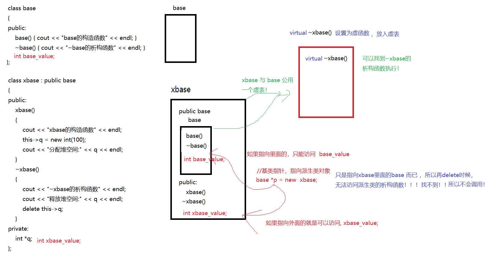
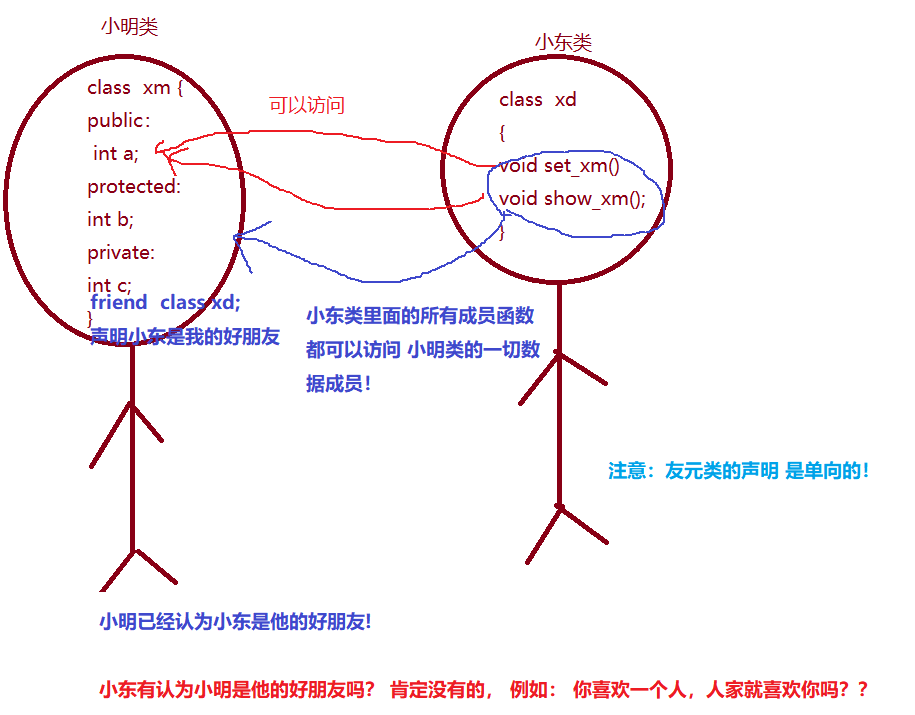

<!-- @import "[TOC]" {cmd="toc" depthFrom=1 depthTo=6 orderedList=false} -->

<!-- code_chunk_output -->

- [问题引入](#问题引入)
- [虚析构](#虚析构)
    - [概念：](#概念)
    - [作用：](#作用)
    - [特点：](#特点)
    - [如何应用：](#如何应用)
- [纯虚函数](#纯虚函数)
    - [基本语法](#基本语法)
    - [抽象类的作用](#抽象类的作用)
    - [为什么需要纯虚函数](#为什么需要纯虚函数)
    - [虚函数与构造函数](#虚函数与构造函数)
    - [虚函数与析构函数](#虚函数与析构函数)
    - [提问](#提问)
- [友元](#友元)
  - [友元的概念](#友元的概念)
  - [友元的种类](#友元的种类)
    - [友元函数](#友元函数)
    - [友元类](#友元类)
      - [友元类的定义](#友元类的定义)
    - [友元成员函数(类中的成员函数作为友元)](#友元成员函数类中的成员函数作为友元)

<!-- /code_chunk_output -->

## 问题引入
**问题** :  通过基类指针，释放派生类的堆空间时，并不会调用派生类的析构函数，导致派生类中构造分配的资源未被释放。



当没有成功调用子类析构函数时，通常是由于基类的析构函数不是虚析构函数。这会导致在通过基类指针删除派生类对象时，只会调用基类的析构函数，而不会调用派生类的析构函数。下面是一个示例代码，展示了没有成功调用子类析构函数的情况：

```cpp
#include<iostream>
using namespace std;

class Base {
public:
    Base() {
        cout << "Base Constructor" << endl;
    }
    
    ~Base() {
        cout << "Base Destructor" << endl;
    }
};

class Derived : public Base {
public:
    Derived() {
        cout << "Derived Constructor" << endl;
    }

    ~Derived() {
        cout << "Derived Destructor" << endl;
    }
};

int main() {
    Base* ptr = new Derived();
    delete ptr;

    return 0;
}
```

在上述示例中，`Base` 是基类，`Derived` 是派生类。然而，基类的析构函数 `~Base()` 没有被声明为虚析构函数。

在 `main()` 函数中，我们使用基类指针 `ptr` 指向派生类对象，并使用 `new` 运算符创建对象。接下来，我们使用 `delete` 运算符删除对象。

由于基类 `Base` 的析构函数不是虚析构函数，所以只会调用基类的析构函数，而没有调用派生类 `Derived` 的析构函数。

输出结果为：
```bash
Base Constructor
Derived Constructor
Base Destructor
```

可以看到，只有基类 `Base` 的构造函数和析构函数被调用，派生类 `Derived` 的析构函数没有被调用。这表示在删除对象时没有成功调用子类的析构函数，可能导致内存泄漏和资源泄漏问题。为了正确调用子类析构函数，需要将基类的析构函数声明为虚析构函数，并确保在删除对象时使用正确的方式。

## 虚析构

#### 概念：
虚析构函数是一个在 C++ 中使用的特殊类型的析构函数，用于实现多态性。通过将基类的析构函数声明为虚析构函数，可以确保在删除派生类对象时，会正确调用派生类的析构函数。

#### 作用：
虚析构函数的主要作用是允许通过基类指针或引用来删除派生类的对象，并在运行时正确调用派生类的析构函数。这对于涉及到继承关系的代码非常重要，因为如果基类的析构函数不是虚析构函数，则可能导致内存泄漏和未定义的行为。

#### 特点：
- 虚析构函数必须在基类中进行声明，并在派生类中进行实现（覆盖）。
- 在基类中，使用 `virtual` 关键字来标识虚析构函数。
- 虚析构函数可以通过基类指针或引用调用，并确保正确调用派生类的析构函数。
- 当通过基类指针删除派生类对象时，需要注意使用 `delete` 运算符而不是 `delete[]`（删除数组对象时使用）。

#### 如何应用：
虚析构函数常常用于以下情况：
- 当基类指针或引用指向派生类对象时，通过使用虚析构函数来确保在删除对象时正确调用派生类的析构函数。
- 当基类中存在其他虚函数时，通常建议将析构函数也声明为虚析构函数，以确保多态性和动态绑定的一致性。

下面是一个示例来说明虚析构函数的应用：

```cpp
#include<iostream>
using namespace std;

class Base {
public:
    Base() {
        cout << "Base Constructor" << endl;
    }

    virtual ~Base() {
        cout << "Base Destructor" << endl;
    }
};

class Derived : public Base {
public:
    Derived() {
        cout << "Derived Constructor" << endl;
    }

    ~Derived() override {
        cout << "Derived Destructor" << endl;
    }
};

int main() {
    Base* ptr = new Derived();
    /*  
        先使用new操作符在堆上分配了一个存储xDerived对象的内存块，构造
        Derived对象，调用Derived类的构造函数来初始化刚分配的内存块
    */
    delete ptr;// 释放堆空间 通过基类指针删除对象，自动调用派生类的析构函数

    return 0;
}
```

在上述示例中，`Base` 是一个基类，`Derived` 是一个派生类，并且 `~Base()` 和 `~Derived()` 都被声明为虚析构函数。

在 `main()` 函数中，我们通过基类指针指向派生类对象，并使用 `new` 运算符进行创建。然后，通过 `delete` 运算符删除对象。由于基类的析构函数是虚析构函数，它会自动调用派生类的析构函数。

输出结果为：
```bash
Base Constructor
Derived Constructor
Derived Destructor
Base Destructor
```

可以看到，在删除对象时，首先调用派生类的析构函数，然后调用基类的析构函数。这是通过使用虚析构函数来确保正确的析构顺序和资源的释放。

## 纯虚函数

#### 基本语法
普通的虚函数，其定义形式如下：
```cpp
class A
{
    virtual void someFunc();
};
```
而所谓的纯虚函数，其定义形式如下：
```cpp
class A
{
    virtual void someFunc() = 0; // 注意此处，有个 "=0"
};
```
形如上述代码所示，在声明尾处加了` =0 `的虚函数被称为纯虚函数。**包含了纯虚函数的类被称为抽象基类**`（Abstract Base Class，简称ABC）`，关于纯虚函数和抽象基类的语法规则如下：

- 纯虚函数可以提供实现代码，也可以不提供实现代码而只提供接口声明
- **不管基类是否提供了纯虚函数的实现，抽象基类不能定义对象**
- **抽象基类的子类必须提供纯虚函数的实现代码才能定义对象，否则其子类仍为抽象基类**

比如上述例子，是无法定义对象的：
```cpp
// pureVirtualMethod.cpp
int main()
{
    A a;
}
```
编译报错：
```bash
gec@ubuntu:$ g++ pureVirtualMethod.cpp
pureVirtualMethod.cpp: In function ‘int main(int, const char**)’:
pureVirtualMethod.cpp:23:7: error: cannot declare variable ‘a’ to be of abstract type ‘A’
   23 |     A a;
      |       ^
gec@ubuntu:$
```
只有当其派生出子类，并且子类复写了父类所有的纯虚函数后，才能基于子类定义对象。比如：

```cpp
class B : public A
{
    void someFunc(){} // 复写父类的纯虚函数（此处为空函数）
};

int main()
{
    B b; // 正确
}
```

#### 抽象类的作用

抽象类的作用:预留接口提供派生类去覆盖，方便实现动态多态。  
```Plain Text
1.提高代码重用性：实现动态多态，就是提高复用性。 

2.类型安全性：抽象无法创建对象，这样对于一些不复合常理的类，就不能创建。 

3.代码可读性和可维护性：抽象类提供了一个基类，子类可以继承这个基类，从而简化代码的编写过程。
```

#### 为什么需要纯虚函数
纯虚函数实际上是父类用来规范子类的一种手段，当父类出现纯虚函数时，就意味着给后代子类规范了一个必须实现的接口（类方法），这在现实中是非常常见的情形，比如：

* 由于所有的飞行器都必然会飞行，且各种不同的飞行器的飞行方式各不相同，那么飞行器作为基类就应该定义一个类似 `virtual void fly() = 0;` 这样的纯虚函数，强迫所有的客机、战斗机、热气球、直升机等等必须提供一个叫 `fly() `的类方法，否则就无法构建对象。至于该接口如何实现？那就是各个飞行器类根据自己的实际情况要去做的事情了。


* 由于所有的按钮都必然需要被绘制才能显现，且各种不同按钮的绘制行为各不相同，那么按钮类（QAbstrat Button）作为基类就应该定义一个类似 virturl void paintEvent() = 0; 这样的纯虚函数，强迫所有的单选按钮、复选按钮、写实按钮等等必须提供一个叫 paintEnven() 的类方法，否则就无法显现按钮图形。至于该接口如何实现？那就是各种按钮根据自己的实际情况要去做的事情了。
<div align="center">
  
</div>

显而易见，如果把普通的虚函数理解为基类给派生类**建议性**的接口实现建议的话，那么纯虚函数就是基类给派生类强迫性的接口设计规范。

略显吊诡的是，C++居然允许纯虚函数可以有一个基类的版本，基类的纯虚函数的代码实现既不会改变基类无法定义对象的事实，也无法成为子类默认可用的版本。因此抽象基类的纯虚函数的实现版本在实际应用中并不多见，可以理解为 C++ 语言为无法预料的现实世界的一种妥协，给不可预知的场景留下后路的做法。


#### 虚函数与构造函数
构造函数不能是虚函数，逻辑上说不通，语法上也不允许。

- 虚函数意味着将来要被子类的同名类方法**复写**，这不符合构造函数的逻辑，因为子类对象在构造时不能略过父类，恰好相反，构造子类对象时必须先妥善构造其继承的父类对象组件。
- 构造函数不能是普通虚函数，更不能是纯虚函数。

#### 虚函数与析构函数
先说结论：

- 如果一个类确定不会成为别的类的父类，那么该类的析构函数只需是普通函数即可。
- 如果一个类可能会成为别的类的父类，那么该类的析构函数必须定义为虚函数。
```cpp

class Base
{
public:
    // 虚析构函数: 保证在针对父类执行delete操作时，能正确释放子类的资源
    virtual ~Base(){}
};

class Derived : public Base
{
    int *p;

public:
     Derived(){p = new int[100];}
    ~Derived(){delete [] p;}
};

int main()
{
    Base *b = new Derived;
    Deived p1;
    // 释放父类指针或引用
    // 由于 b 的父类拥有虚析构函数，因此能正常调用 b 的析构函数
    delete b; 
    
    return 0;
}
```
虚·析构函数 与 虚·普通函数本质上都是一样的，唯一的区别是：由于每个类的析构函数有且仅有一个，因此虚析构函数无需同名，也无法同名。

#### 提问
__一、虚函数能重载吗？如何确保派生类正确复写了基类的虚函数？__
能。
但要注意，虚函数的重载要看类域的情况。

1. 从基类继承下来的虚函数，其作用范围依然是基类的类域。
2. 派生类继续定义的同名虚函数，其作用域是派生类的类域。
3. 基于以上两点，基类和派生类的虚函数不管怎么定义，定义多少个，他们之间不构成重载。
    但是他们内部可以构成重载。
4. 派生类中跟基类中的签名一致的虚函数，会构成复写。
5. 复写（override）的含义是派生类的函数版本，“覆盖”了基类的版本。 
    “覆盖”的时机是当你使用基类的指针或引用的时候。
6. 在派生类中，可以在复写基类的虚函数时加一个 override 关键字来明确告诉编译器此处是
    复写基类虚函数的行为，以防止派生类误定义了别的函数而被开发者以为是复写。


```cpp
class Base
{
    // 以下两个虚函数，构成重载
    virtual void f(int);
    virtual void f(float);
    
    void f1();
    virtual void f2(int);
};

class Derived : public Base
{
    // 以下两个虚函数，构成重载
    virtual void f(string);
    virtual void f(double);
    
    void f1();  // 此同名函数不会复写基类的版本
    virtual void f2(int); // 此同名函数会复写基类的版本
    
    // override确保: 基类中必定存在一个完全一致的虚函数，否则报错。
    virtual void f(int) override;
};

int main()
{
    Base *p = new Derived;
    delete p; // 调用~Base() ？ 还是调用 ~Derived()
    
    p->f1(); // 调用的是基类的版本
    p->f2(); // 调用的居然是派生类的版本
}
```

__二、简述构造函数、析构函数和虚函数的关系。__

- 构造函数不能是虚函数（语法规则）。
- 析构函数是否需要设计成虚函数，要具体情况具体分析
    * 如果不是基类，那么设计为虚函数毫无意义，虚函数只服务于类的继承体系之中。
    * 如果是基类，一般要设计为虚函数，否则基类指针或引用无法正确释放派生类的资源。


__三、为什么多态基类需要声明 virtual 析构函数？__

基类的指针或引用才能正确调用派生类的析构函数，从而释放派生类的资源。


__四、为什么不能在构造和析构的过程中调用 virtual 函数？__

- 在构造期间，派生类版本的虚函数尚未就绪。
- 在析构期间，派生类版本的虚函数可能已经消失。
- 综上所述，在构造和析构期间，虚函数不虚。即：只有在构造之后和析构之前，虚函数才有意义。


## 友元

### 友元的概念
当我们想从类外访问类内部数据的时候，除非我们是类成员，或即将要访问的数据是公有数据，否则是无法访问的。这也恰恰是类成员权限限定符` public 、protected、private `的设计初衷，它们可以更好地保护类内数据，更好地体现封装性。

但是，在某些场合，我们却需要在类外对类内部的非公有数据进行访问，比如一台遥控器对象和一台电视对象，遥控器绕过电视机的公有控制面板，直接改变电视机的音量、频道、启停等状态，很明显遥控器对象必然要访问电视机对象的内部非公有数据，但它们属于不同的两个类，并且也没有继承关系。
<div align="center">
  
</div>
像上述例子，就需要让遥控器类或遥控器中的某些类方法成为电视机类的友元，友元就是朋友，既然遥控器是电视机的朋友，那么遥控器访问电视机的内部数据的时候，电视机就会视遥控器为家人，可以让其任意访问所有权限的内部数据。

### 友元的种类

#### 友元函数

假设有如下类 A，我们希望普通函数 show() 可以访问其内部私有数据，那么可以在类中将该函数声明为类的友元，语法如下：
```cpp
class A
{
    int x;

    // 声明一个友元函数
    friend void show(const A &r);
};
```
**语法要点：**

- 虽然函数 show 不是类方法，但可以访问任意的类成员。
- 友元函数与 public 、protected、private 等无关。

而友元函数的定义，则与普通的函数定义无异：
```cpp
void show(const A &r)
{
    cout << r.x << endl;
}
```
**语法要点：**

- 友元函数可以直接访问类私有成员。
- 友元函数的**定义**不要写 `friend`。

**特点：**

- 友元函数不属于任何类，但可以访问类的非公有成员。
- 友元函数在类的定义中声明，在类外部进行定义和实现。
- 友元函数不继承，也不能被派生类所覆盖。

**作用：**

- 友元函数可以访问类的私有成员，从而提供了对**类的封装性的破坏**。它可以完全访问类的私有成员，包括数据成员和成员函数。
- 友元函数可以增加类与类之间的灵活性和扩展性，使得类的设计更为灵活。
- 友元函数能够方便地实现对多个类的操作，例如重载运算符时常使用友元函数来实现两个不同类对象之间的运算。

**应用：**

- 友元函数常用于重载运算符，例如重载`"+"`和`"<<"`等运算符，使得类的对象可以通过运算符进行直接操作。
- 友元函数在某些情况下可以作为类的辅助函数，提供一些额外的功能或操作。

__友元函数 访问权限 可以继承吗？__   

不可以！爸爸的朋友并不是儿子的朋友。  

__一个类可以有多个友元函数吗？__     

肯定可以，每个人都有很多不同的朋友。  

__一个友元函数可以声明在多个类中吗 ？__ 

可以的，声明了一个类就对该类的所有成员具有访问权限。 

#### 友元类

当一个类是另外一个类的友元类时，当前类的所有成员函数就可以访问对方的一切数据成员和成员函数。


##### 友元类的定义
```cpp
friend  class 类名;
```
``` cpp
// 电视机类
class TV
{
    int channel;

    // 在电视机类中，将遥控器类声明为友元类
    friend class Remoter;
};
```
```cpp
// 遥控器类
class Remoter
{
public:
    void setChannel(TV &r, int c)
    {
        // 遥控器类中可以直接访问电视机类任意内部数据
        r.channel = c;
    }
};
```
这样，就可以使用遥控器对象去控制电视机了，例如：
```cpp
int main(void)
{
    TV xiaomi;
    Remoter r;

    // 使用遥控器将电视机调整到5号频道
    r.setChannel(xiaomi, 5);
}
```

练习:  利用友元类的技术点，让两个类互为友元，并访问对方的私有成员。  遇到语法错误，思考如何解决？  

```c++
/*
友元类的练习.cpp: In member function ‘void ClassA::displayPrivateDataB(ClassB&)’:
友元类的练习.cpp:17:69: error: invalid use of incomplete type ‘class ClassB’
   17 |         cout << "ClassA: Accessing private data B from ClassB: " << b.privateDataB << endl;
      |                                                                     ^
友元类的练习.cpp:4:7: note: forward declaration of ‘class ClassB’
    4 | class ClassB; // 前置声明ClassB
      |       ^~~~~~

解决方法：
    在所有类定义完毕后，再去类外定义这些访问友元类的成员函数

*/
#include <iostream>
using namespace std;

class ClassB; // 前置声明ClassB

// 定义ClassA类
class ClassA
{
private:
    int privateDataA;

public:
    ClassA() : privateDataA(20) {}

    void displayPrivateDataB(ClassB &b);
    // {
    //     cout << "ClassA: Accessing private data B from ClassB: " << b.privateDataB << endl;
    // }
    // 声明ClassB为友元类，可以访问其私有成员
    friend class ClassB;
};

// 定义ClassB类
class ClassB
{
private:
    int privateDataB;

public:
    ClassB() : privateDataB(12) {}

    void displayPrivateDataA(ClassA &a);
    // {
    //     cout << "ClassB: Accessing private data A from ClassA: " << a.privateDataA << endl;
    // }
    // 声明ClassA为友元类，可以访问其私有成员
    friend class ClassA;
};

void ClassA::displayPrivateDataB(ClassB &b)
{
    cout << "ClassA: Accessing private data B from ClassB: " << b.privateDataB << endl;
}

void ClassB::displayPrivateDataA(ClassA &a)
{
    cout << "ClassB: Accessing private data A from ClassA: " << a.privateDataA << endl;
}

int main()
{
    ClassA objA;
    ClassB objB;

    objB.displayPrivateDataA(objA); // ClassB访问ClassA的私有成员值
    objA.displayPrivateDataB(objB); // ClassB访问ClassA的私有成员值

    return 0;
}
```

#### 友元成员函数(类中的成员函数作为友元)

友元成员函数是指**一个类的成员函数可以被声明为另一个类的友元函数**。当一个类将另一个类的成员函数声明为友元函数时，该友元函数可以访问该类的所有成员，包括私有成员、保护成员和公有成员。友元成员函数的声明在类中进行，但定义和实现通常在类外部进行。
```cpp
#include <iostream>
using namespace std;
// 前向声明  value类
class value;

class base
{
public:
    void set_value(value &v);

    void show_value(value &v);
};

class value
{
private:
    int v;
    // friend class base; // 声明base是当前类友元,base类的有函数都可以访问 value的私有成员
    friend void base::set_value(value &v); // 只声明了 set_value
};

// 所有类定义完毕后编写函数 定义函数
void base::set_value(value &v)
{
    v.v = 10;
}

void base::show_value(value &v)
{
    cout << v.v << endl; // 未声明为友元，不能访问私有
}

int main()
{
    value v;

    base b;
    b.set_value(v);
    b.show_value(v);
}
```