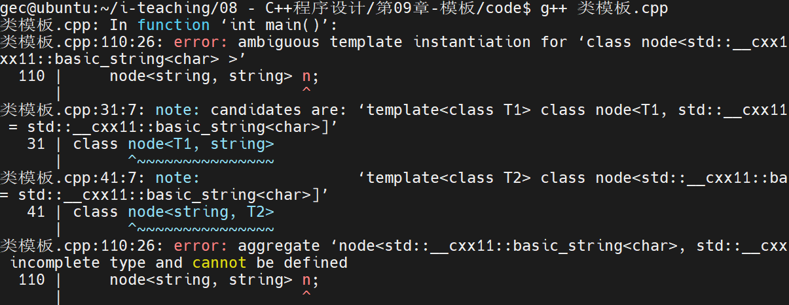
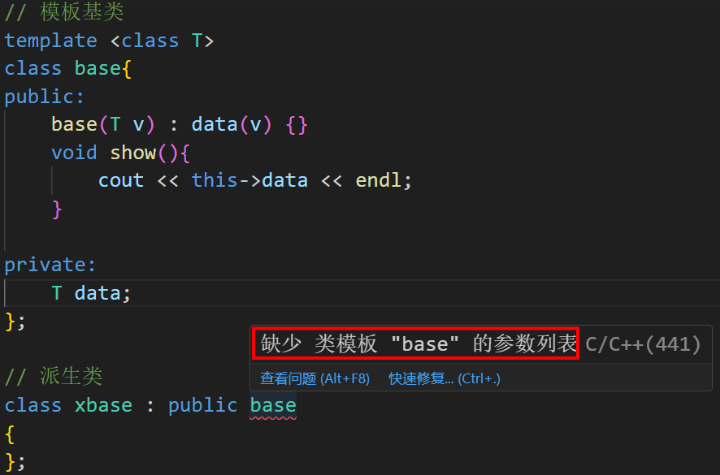

<!-- @import "[TOC]" {cmd="toc" depthFrom=1 depthTo=6 orderedList=false} -->

<!-- code_chunk_output -->

- [模板](#模板)
    - [1. 基本概念](#1-基本概念)
    - [2. 函数模板语法](#2-函数模板语法)
      - [2.1 函数模板的定义](#21-函数模板的定义)
      - [2.2 函数模板的重载](#22-函数模板的重载)
        - [练习：编写一个函数模板，返回两个参数中的较大值。参数可以是任意可比较大小的数据类型。](#练习编写一个函数模板返回两个参数中的较大值参数可以是任意可比较大小的数据类型)
      - [2.3 函数模板的特化](#23-函数模板的特化)
        - [思考：单独定义一个喂养鲸鱼的函数，跟特化喂养函数模板，有何不同？](#思考单独定义一个喂养鲸鱼的函数跟特化喂养函数模板有何不同)
      - [模板函数与普通函数区别](#模板函数与普通函数区别)
- [类模板](#类模板)
    - [1. 基本概念](#1-基本概念-1)
    - [2. 类模板的定义](#2-类模板的定义)
    - [3. 类模板的特化](#3-类模板的特化)
      - [3.1 偏特化](#31-偏特化)
      - [3.2 全特化](#32-全特化)
    - [4. 其他语法](#4-其他语法)
        - [语法重点](#语法重点)
    - [5.类模板定义对象](#5类模板定义对象)
    - [类模板的继承](#类模板的继承)
- [C++ 标准模板库(STL)](#c-标准模板库stl)
    - [C++ Vectors](#c-vectors)

<!-- /code_chunk_output -->

# 模板
### 1. 基本概念

- 几个同名函数，如果参数列表不同，算法也不同，那么适合采用重载
- 几个重载函数，如果只是参数类型不同，算法一致，那么适合采用模板

比如，要设计一个求出两个给定数据最大值的函数，由于给定的数据可能是各种不同的类型，可以考虑函数重载，但马上会发现重载函数的内部算法都是差不多的，甚至是一样的，因此这些重载函数就显得很臃肿了。此时更好的选择是将这些算法一致的函数抽象为模板，进一步优化代码结构。

函数模板仅仅是一个设计蓝图，并不会产生任何函数实例，直到发生具体的调用行为并匹配了之后，才会产出具体的函数。

### 2. 函数模板语法

#### 2.1 函数模板的定义
函数模板就是函数参数使用了通用类型，就是函数模板。

模板定义会用到关键字：

```cpp
template <typename（旧用class）>
```
具体用法如下：

```cpp
// 类型参数列表，其中typename可以写成class
template <typename T1, typename T2>
void someFunc(T1 a, T2 a)
{}

// 以下是对函数模板的调用
someFunc<const char *, int>("abcd", 100); // <const char *, int>显式地指定模板类型参数
someFunc("abcd", 100); // 省略模板类型参数，系统会根据实际的参数类型自动推导(不是隐式转换，是推导，不一样)

```

上述例子中，template规范了someFunc是一个函数模板而不是一个函数，而 T1 和 T2 是类型参数，与数据参数不同，传给模板的是类型，而不是数据。模板得到类型之后，再使用类型去定义参数： (T1 a, T2 b)

注意
函数模板调用时，可以显式地写上传递的参数的类型，他们使用尖括号传递。圆括号负责传递数据，即函数模板有两个参数列表，但第一个类型参数列表可以省略：
```cpp
someFunc<const char *, int>("abcd", 100);
someFunc("abcd", 100);
```
#### 2.2 函数模板的重载
函数模板的重载：

- 起因：一个模板代表一堆函数，如果这一堆函数都无法满足你的要求，那么就有两种选择：
    * 第一，重载这个模板。
    * 第二，特化一个函数版本；

函数模板等于是某种参数个数相同的一堆函数的集合体。跟函数一样，函数模板也可以重载。当我们重载一个函数时，我们会得到另一个同名的函数。当我们重载一个函数模板时，我们会得到另一堆同名的函数。

具体语法如下：
```cpp
// 编写一个函数模板f，形成一堆相互重载的单参数函数
template <typename T>
void f(T a)
{
    cout << "一堆接受一个任意参数的函数" << endl;
}

// 重载以上的函数模板f，形成另一堆相互重载的双参数函数
template <typename T1, typename T2>
void f(T1 a, T2 b)
{
    cout << "另一堆接受两个参数的函数" << endl;
}
```

##### 练习：编写一个函数模板，返回两个参数中的较大值。参数可以是任意可比较大小的数据类型。
```cpp

#include <iostream>
#include <cstring>
using namespace std;

template <typename T>
T maxValue(T a, T b)
{
    return a>b ? a : b;
}

template <>
const char * maxValue(const char* a, const char* b)
{
    return strcmp(a, b)>0 ? a : b;
}

int main(int argc, char const *argv[])
{
    cout << maxValue(1, 2) << endl;
    cout << maxValue(1.1, 1.2) << endl;
    cout << maxValue("abc", "abcd") << endl;

    return 0;
}
```


#### 2.3 函数模板的特化
模板特化的意思是特殊化某个版本，将某个特定的函数版本抽出来单独定义，这通常是由于具体问题的算法不一致所需。

众所周知，模板解决的经典场景就是参数类型不同但算法一致的情形，比如动物园饲养员喂养动物，动物和饲料的类型可能是各种各样的，但假设喂养的动作都基本差不多，那么就可以定义模板来解决求取该问题。
比如：
```cpp
template <typename T1, typename T2>
void feed(T1 animal, T2 food)
{
    // 将 food 倒到盆里
    // 将 animal 叫过来吃
}
```
这样就不用为每种动物每种饲料定义函数了，只要一个模板搞定了。但当出现某种类型无法套用大家一致算法的时候，就需要将其特定的算法单独实现出来，形成这个函数模板的一个特化版本。比如喂养一头鲸鱼…
此时喂养的办法无法套用上述套路，喂养鲸鱼这个 feed() 行为要不单独定义一个函数，要不特化原有的模板，如下：
```cpp
template <typename T2>
void feed(Whale w, T2 food)
{
    // 喂养一头鲸鱼...
}
```
##### 思考：单独定义一个喂养鲸鱼的函数，跟特化喂养函数模板，有何不同？

直接定义函数的话，不管是否调用该函数，函数都已存在，占用一定的内存。而定义函数模板的话，则函数只在有具体调用行为出现时才会被系统产生出来，否则不会有任何该版本的函数存在。

#### 模板函数与普通函数区别

```plain text
1.如果模板函数与普通函数实现的功能一致时， 优先调用普通函数。 
2.如果模板函数参数匹配精度比普通函数高时，优先调用模板函数。  
3.普通函数具有自动类型转换功能，模板函数具有自动推导功能。
4.当模板函数无法推导类型时，用户需要多定义几个通用类型  或 指定模板类型 
  4.1 定义多个通用类型让模板函数推导成功
  template <class T, class T1>
  T add(T a, T1 b)
  {
    cout << "调用模板函数" << endl;
    return a + b;
 }
 4.2 指定模板的类型  
      函数名<类型>(参数列表)
      add<int>(a, b)  :指定模板类型为int
      
5.模板函数也可以重载

```

# 类模板
### 1. 基本概念

跟函数模板类似，类也可以有模板。类模板要表达的逻辑是**拥有相同行为接口但拥有不同数据类型的对象，可以被定义成类模板。**

举个例子，链表类，链表是用来存储数据，并提供诸如插入、删除、检索、合并等操作的容器，这些操作与具体存储的数据的类型是无关的。因此当我们设计一个类来表达链表的时候，很自然地就想用模板的方式来设计。


### 2. 类模板的定义
类模板定义也会用到如下关键字：

```cpp
template <typename（旧用class）>
```
具体用法如下：
```cpp
// 类模板定义
template <typename T1, typename T2>
class node
{
public:
    node(){cout << "通用版本" << endl;}
private:
    T1 a;
    T2 b;
};
```
注意
使用类模板定义类对象时，尖括号的类型参数列表不可省略，这个函数模板不一样。

```cpp
node<short, double> a; // 此处必须注明传递给类模板的参数类型
```

### 3. 类模板的特化
#### 3.1 偏特化
与函数模板类似，当类模板中的类型参数有个别需要实现单独的类版本时，可以将这种特定的类特化一个版本。当类模板中部分的类型参数需要特化时，称为偏特化，当所有的类型参数都需要特化时，称为全特化。

还是以上述类模板为例，假设当第一个参数类型为 string 时，需要提供一个特定版本的类，实现如下：
```cpp

template <typename T>
class node<string, T>
{
public:
    node(){cout << "偏特化" << endl;}
private:
    string a;
    T b;
};

```

类似的，假设当第二个参数为 string 时，需要提供另一种不同版本的类，实现如下：
```cpp
template <typename T>
class node<T, string>
{
public:
    node(){cout << "另一种偏特化" << endl;}
private:
    T a;
    string b;
};

```

**注意1**
特化版本中，类的声明语句中需要指明类型的情况，即上述代码中的 `<T, string>`

**注意2**
当只是定义上述类模板及其特化版本时，编译是正确的，但是注意到，上述两种特化版本在两个类型参数均为 string 类型时，将会产生二义性：
```cpp
int main(void)
{
    node<string, string> n;
}
```



上述报错信息显示，两个不同的偏特化版本都可以匹配，从而导致编译器无法抉择，导致二义性。这在编程中要注意避免。

#### 3.2 全特化

当类模板中全部类型参数都被特化时，被称为全特化。例如，假设当两个类型参数分别为 `double` 和 `string` 时，需要提供如下特定版本的类的实现：
```cpp
template <>
class node<double, string>
{
public:
    node(){cout << "全特化" << endl;}
private:
    double a;
    string b;
};
```
注意
此时如果有如下定义，编译器不会产生二义性：
```cpp
node<double, string> d; // 全特化
```
__更详细的解释__
全特化（Full specialization）是C++中模板的特性之一，用于对特定的模板参数提供特定的实现。

当使用模板时，通常通过在函数或类的定义前添加 `template <typename T>` 或 `template <class T>` 来声明一个模板。这样的模板是通用的，适用于多个类型或值。

然而，有时我们希望针对特定的类型或值，提供一个具体的实现。这就是全特化的作用——为特定的模板参数提供特殊的定义。

下面是函数模板和全特化的示例：

```cpp
#include <iostream>

template<typename T>
void print(T value) {
    std::cout << "General template: " << value << std::endl;
}

template<>
void print<int>(int value) {
    std::cout << "Specialized template for int: " << value << std::endl;
}

int main() {
    print(3.14);  // 使用通用模板
    print(42);    // 使用全特化模板

    return 0;
}
```

在上面的例子中，`print` 函数被定义为一个模板函数，并具有通用的模板参数 `T`。然后，我们进行了全特化，为 `int` 类型提供了一个特殊的函数实现。

当调用 `print(3.14)` 时，由于没有与 `double` 类型相匹配的全特化，因此将使用通用模板输出 `"General template: 3.14"`。而当调用 `print(42)` 时，由于有与 `int` 类型匹配的全特化，因此将输出 `"Specialized template for int: 42"`。这样可以根据需要为不同的类型提供定制的行为。

注意，全特化只适用于函数模板和类模板（泛型类），不能用于成员函数的特化。此外，全特化只能对全部模板参数进行特化，而无法对部分模板参数进行特化。


### 4. 其他语法
4.1 类模板的静态成员
类模板也可以定义静态成员，由于静态成员的存储不在类对象内部，因此跟普通的类定义一样，类模板的静态成员也必须在类外定义，例如：
```cpp
// 类模板
template <typename T>
class A
{
    static int count; // 类模板的静态成员
};

// 类模板的静态成员初始化
template <typename T>
int A<T>::count = 0 ;
```

##### 语法重点

跟普通的类定义不同，类模板的类方法定义必须放在头文件 *.h 中，不可以放在 *.cpp 中，这是因为类模板只是设计蓝图，在链接之前并未产生任何实质的代码，即在 *.cpp 到 *.o 文件的编译过程中不会有任何类模板产生的实质类定义出现，因此不能像普通的类那样将类定义和类方法定义分开放在 *.h 和 *.cpp ，而是必须统一放在 *.h 中。

[STL vector仿写](https://github.com/YESZGG/ZGG_C)
这里就是我把将类定义和类方法定义分开放在 *.h 和 *.cpp，导致我的`main.cpp`得要`#include "myvector.cpp"`才可以编译成功


### 5.类模板定义对象
1.模板类定义对象时，必须提供参数类型！！ 
2.模板类没有自动类型，推导功能！！
```cpp
#include <iostream>
using namespace std;

template <class T>
class base
{
public:
    base(T v) : value(v) {}

private:
    T value;
};

int main()
{
    //<不会> 根据用户传递的 100 推导模板类型为 int !!
    base tmp(100); // 错误，没有提供模板的参数类型，无法定义对象
    base<int> tmp2(10); // 成功，指定模板类的参数类型
}
```

当模板类作为参数传递时，有一些注意事项需要考虑：

1. 提供具体的模板参数类型：在将模板类作为参数传递给其他函数或类时，必须提供实际的模板参数类型。这可以通过指定模板参数类型明确地实例化模板类，然后将实例化后的对象作为参数传递。

2. 依赖于模板参数类型：模板类的定义可能依赖于模板参数类型，包括成员变量类型、成员函数返回类型以及函数签名。在将模板类作为参数传递时，需要考虑传递的实际类型是否满足模板类的要求。

3. 多个模板参数：如果模板类有多个模板参数，需要为每个模板参数提供具体的类型或值。根据情况，可以选择指定所有模板参数类型，或者让编译器自动推导部分模板参数类型。

下面是一个示例，展示了如何将模板类作为参数传递，并定义一个继承自模板类的派生类：

```cpp
template<typename T>
class MyTemplate {
public:
    T value;
    
    void print() {
        std::cout << "Value: " << value << std::endl;
    }
};

template<typename T>
void processObject(MyTemplate<T> obj) {
    // 对模板类实例进行处理
    obj.print();
}

template<typename T>
class Derived : public MyTemplate<T> {
public:
    void additionalFunction() {
        // 执行派生类特定的操作
    }
};

int main() {
    MyTemplate<int> obj;
    obj.value = 42;
    processObject(obj); // 将模板类对象传递给函数

    Derived<double> derivedObj;
    derivedObj.value = 3.14;
    derivedObj.additionalFunction();

    return 0;
}
```

在上述示例中，我们首先创建一个模板类 `MyTemplate`，并定义了一个成员函数和一个全局函数，其中 `processObject` 接受一个 `MyTemplate` 类型的参数。然后，我们通过实例化模板类 `MyTemplate<int>` 创建一个对象 `obj`，并使用 `processObject` 函数对其进行处理。

此外，我们还定义了一个派生类 `Derived`，继承自模板类 `MyTemplate` 并添加了一个额外的成员函数。我们使用 `Derived<double>` 实例化该派生类，并对其进行操作。

### 类模板的继承

当一个基类是一个模板类时，无法直接通过类名进行继承！


解决方法：
```cpp
1.指定基类的模板类型  
class xbase : public base<int> 

2.继续把类型模板化 
template <class T>
class xbase2 : public base<T>

```

# C++ 标准模板库(STL)
C++ STL (Standard Template Library标准模板库) 是通用类模板和算法的集合，它提供给程序员一些标准的数据结构的实现如 queues(队列), lists(链表), 和 stacks(栈)等.

C++ STL 提供给程序员以下三类数据结构的实现:

- 顺序结构 
    * C++ Vectors 
    * C++ Lists 
    * C++ Double-Ended Queues 
- 容器适配器 
    * C++ Stacks 
    * C++ Queues 
    * C++ Priority Queues 
- 联合容器 
    * C++ Bitsets 
    * C++ Maps 
    * C++ Multimaps 
    * C++ Sets 
    * C++ Multisets 

### C++ Vectors
Vectors 包含着一系列连续存储的元素,其行为和数组类似。访问Vector中的任意元素或从末尾添加元素都可以在常量级时间复杂度内完成，而查找特定值的元素所处的位置或是在Vector中插入元素则是线性时间复杂度。

|方法|作用|
| :-------:|:-----------|
| Constructors | 构造函数 |
| Operators |对vector进行赋值或比较 |
| assign() |对Vector中的元素赋值 |
| at() |返回指定位置的元素 |
| back()| 返回最末一个元素 |
| begin()| 返回第一个元素的迭代器 |
| capacity()| 返回vector所能容纳的元素数量(在不重新分配内存的情况下） |
| clear()| 清空所有元素 |
| empty()| 判断Vector是否为空（返回true时为空） |
| end()| 返回最末元素的迭代器(译注:实指向最末元素的下一个位置) |
| erase()| 删除指定元素 |
| front()| 返回第一个元素 |
| get_allocator()| 返回vector的内存分配器 |
| insert()| 插入元素到Vector中 |
| max_size()| 返回Vector所能容纳元素的最大数量（上限） |
| pop_back()| 移除最后一个元素 |
| push_back()| 在Vector最后添加一个元素 |
| rbegin()| 返回Vector尾部的逆迭代器 |
| rend()| 返回Vector起始的逆迭代器 |
| reserve()| 设置Vector最小的元素容纳数量 |
| resize()| 改变Vector元素数量的大小 |
| size()| 返回Vector元素数量的大小 |
| swap()| 交换两个Vector |
