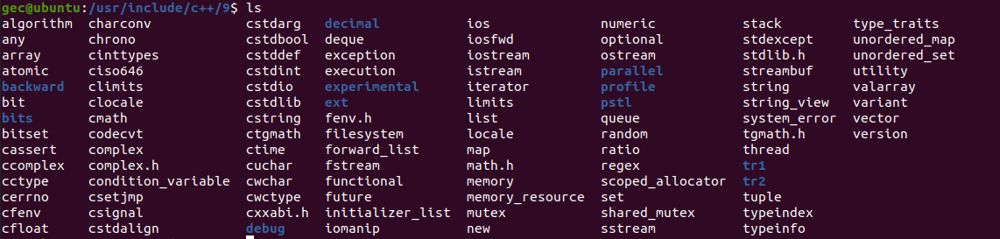

## C++入门（适合学过C语言和接触过C++）
#### 一、C ++ 的历史
> 1972年前后，计算机先驱丹尼斯∙里奇开始设计C语言并用它来重写Unix系统，里奇的这个 决定催生了计算机领域最石破天惊的两门重炮：Unix和C，这两者都是IT产业中鼻祖级的存 在，Unix是现代苹果系统和Linux系统的最初来源，而C则是现代众多编程语言的思想源泉。后来随着IT产业的发展，C语言加入了诸如面向对象、泛型编程等新特性，在1983年前后，贝尔实验室的Bjarne Strou-strup（本贾尼∙斯特劳斯特卢普) 推出了现代编程界中威力最猛的一门重炮：C++。 
> 1998年C++的ANSI/IS0标准被投入使用，通常，这个版本的 C++被认为是标准C++。所有的主流C++编译器都支持这个版本的C++。

#### 二、C ++ 的应用
C++是一种多用途编程语言，广泛应用于各个领域。以下是C++的几个常见应用：

1. **操作系统开发**：C++的低级别控制和直接内存操作功能使其成为操作系统的理想选择。例如，Linux的内核就是使用C++编写的。

1. **游戏开发**：C++在游戏行业中被广泛应用，因为它提供了高性能和低级别的硬件访问能力。许多著名的游戏引擎和游戏软件都是用C++开发的，如Unreal Engine、Unity等。

1. **嵌入式系统**：由于C++具有直接访问硬件的能力，因此在嵌入式系统的开发过程中也得到了广泛应用。它可以用于编写驱动程序、单片机程序、物联网设备等。

2. **高性能计算**：C++以其低级别的控制和高效的运行时性能，成为科学计算和数值计算领域的首选。它在模拟、仿真、图像处理和数据分析等方面发挥着重要作用。

3. **图形应用和图形界面**：通过使用C++和库如OpenGL和Qt，可以开发各种2D和3D图形应用程序以及用户友好的图形界面。

1. **网络编程**：C++提供了一系列网络编程库和框架，使得开发网络应用程序和服务器成为可能。例如Boost.Asio库和Poco库等可以用于网络通信和协议处理。

1. **数据库系统**：许多数据库管理系统（DBMS）使用C++来编写其核心引擎，以实现高效的数据存储和检索。例如MySQL、PostgreSQL等。


总之，由于出生年代较早，C/C++并不是最易用、语法结构最浅显的语言，这主要是因为早期的计算机资源有限，计算机科学家在开发C/C++的时候，**最在意的是最终代码运行的效率，而远非代码编写的难易度，这导致C/C++可以支持非常贴近底层硬件细节的语法，抓地力非常强**，因而学习曲线要比一般的编程语言陡峭，也就是对学习者的要求更高。

但也正是因为以上原因，C/C++天生具有高性能的血统，在目前的IT产业中，凡是涉及底层系统、算法核心、游戏引擎等对性能敏感的领域，C/C++都扮演者着不可或缺的角色，因为这些部件哪怕1%的性能波动，都会对整个软件的体验带来本质的改变。总体来讲，C/C++是一门难学易用的编程语言，是计算机编程领域的重装武器，一旦掌握，威力无比。


#### 三、C/C++的区别

总结上述所述，以下是**C和C++之间的主要区别**：

> **1.面向过程和面向对象**：C语言是一种面向过程的编程语言，而C++在C语言的基础上引入了面向对象编程（OOP）的概念。
> **2.函数重载**：C++支持函数重载，使得同名函数可以根据参数的不同来进行功能扩展，而C语言中同名函数会发生冲突。
> **3.命名空间**：C++引入了命名空间，在定义变量和函数时可以避免命名冲突，提供更多的灵活性和组织性。
> **4.引用传参**：C++支持引用传参，通过引用传递参数比指针传参更高效。引用传参不需要参数传输，而指针传参需要对参数进行复制。
> **5.类和继承**：C++引入了类的概念，并支持继承关系。类使得对象的定义更加直观、封装了数据和方法，继承则可以从父类中派生出新的类来共享相似的属性和方法。
> **6.语法复杂性**：C++相对于C语言拥有更复杂且更多样的语法，因此对于初学者来说具有较高的学习难度。
> **7.应用领域：C语言适合底层开发**，更加注重性能和直接操作硬件；而**C++适合于构建大型软件系统和客户端/服务器应用程序**。

总体而言，C++在功能和灵活性上相对于C语言更为强大，但同时也引入了更多的复杂性。选择使用哪种语言取决于具体的项目需求、开发目标和个人偏好。

#### 四、C ++ 头文件
> 标准c++头文件是不带.h ,  iostream
在c++中使用标准c库 cstdio, 把标准的c库头文件.h去掉在前面添加c

C++的头文件的功能、预处理原理都与C语言无异，下面罗列它们不同与联系：
* C++的标准头文件无需后缀。
* C++可以接收C语言风格后缀的头文件（如`#include <math.h>`），但如有可能，要优先使用C++版本的头文件（如`#include <cmath>`），两者的内容基本是一样的，但后者中的标识符在标准名字空间 std 中均有声明（除了宏之                       外)。
* C++也接收新风格后缀（如*.hpp）。
  
下面是各种后缀的头文件举例：
```cpp
#include <iostream> // c++标准头文件
#include <cmath>    // 在标准名字空间做了声明的改进版math.h
#include <unistd.h> // 无cunistd版头文件
#include <head.hpp> // *.hpp后缀头文件 （比较少）
```


##### 在c++中使用c语言库函数 
```cpp
extern "C"{
    //标准C库函数的头文件
    #include<stdio.h>
    //自定义的第三方C库头文件
    //也就是你使用的C编译器编译好的库对应的头文件
    #include "add.h"
}
```
编译一个动态库的命令：
> gcc -fpic -shared add.c  -o  libadd.so 

这个命令是用于编译生成一个共享库（shared library）的。具体解释如下：

- `gcc` 是 GNU Compiler Collection 的缩写，是一个常用的编译器程序。
- `-fpic` 参数表示生成位置无关代码（Position Independent Code），这是为了使得生成的共享库可以被加载到任意内存地址而不发生错误。
- `-shared` 参数表示生成一个共享库文件，而不是可执行文件。
- `add.c` 是你要编译的源代码文件名。
- `-o libadd.so` 参数表示输出文件名为 `libadd.so`，这是一个约定俗成的共享库文件命名格式。

因此，该命令会将 `add.c` 编译成一个名为 `libadd.so` 的共享库文件。

有以下代码，引用自定义库函数.cpp
```cpp
#include<iostream>
extern "C"{
    //标准C库函数的头文件
    #include<stdio.h>
    //自定义的第三方C库头文件
    //也就是你使用的C编译器编译好的库对应的头文件
    #include "add.h"
}
int main()
{
    std::cout<<"result:"<<add(10,20)<<std::endl;
    return 0;
}
```
下面是编译的命令
```cpp
g++  xxx.cpp  -I.  -L .  -ladd
```
说明：此时如果 `#include "add.h"` 没有使用 `extern "C"` 进行声明，会报错。

> 提问：在C++程序中，如何引用 自定义的库函数 或者 extern "C"的作用是什么 ???
> 答：extern "C" 的作用是为了在 C++ 代码中正确处理 C 语言的函数链接。C 和 C++ 有不同的名称修饰规则，因此直接在 C++ 中引用 C 的函数会导致链接错误。使用 extern "C" 可以告诉编译器按照 C 语言的函数链接规则处理相关函数，使得 C 和 C++ 函数能够正确地进行链接。
```cpp
#ifdef __cplusplus
// 只有在 C++ 编译环境下编译的代码
// 执行一些 C++ 特定的操作
extern "C" {
#endif
// 执行C语言
// C头文件声明

#ifdef __cplusplus
}
#endif
```
##### 静态库与动态库的区别
静态库和动态库是两种常见的代码库，它们在代码的链接和加载方式上存在一些区别。以下是它们的简要区别：

> 1. 链接时机：静态库在编译时被链接到可执行文件中，而动态库在运行时被加载到内存中。
> 2. 大小和资源使用：静态库将其所有代码和依赖项都包含在生成的可执行文件中，因此会增加可执行文件的大小；而动态库只有单个副本，可以被多个可执行文件共享，因此可以节省磁盘空间和系统资源。
> 3. 可执行文件的独立性：由于静态库嵌入到可执行文件中，因此可执行文件可以独立地运行，无需依赖外部库。而动态库需要在运行时加载，因此可执行文件必须能够找到并链接对应的动态库才可正常运行。
> 4. 更新和维护：静态库的更新需要重新编译整个可执行文件，来替换原有的静态库版本。而动态库的更新仅需要替换库文件即可，不需要重新编译可执行文件。
> 5. 内存和性能：静态库在程序启动时被完全加载到内存中，因此加载时间更短，并且在运行时没有额外的库加载开销。动态库则需要在运行时进行加载，可能会有一定的延迟，并且会带来额外的加载和解析开销。
> 6. 可移植性：由于静态库已经被嵌入到可执行文件中，因此可以在没有特定动态库的环境中移植并运行。而动态库则需要确保目标系统具有相应的库文件。

综上所述，选择使用静态库还是动态库取决于项目的需求和设计考虑。静态库适合独立性要求高、依赖项较少的应用；而动态库适合资源共享、更新维护方便的场景。在实际应用中，可以根据具体情况灵活选择静态库或动态库来满足项目的需求。

#### 五、标准输入、输出流

* 标准输入(standard input)与预定义的istream对象 **cin** 对应
* 标准输出(standard output)与预定义的ostream对象 **cout** 对应
* 标准出错(standard error)与预定义的的ostream对象 **cerr** 对应

###### c++ 输入输出流特点：
自适应数据类型(不像C语言需要通过格式控制符来区分)
可以连续操作(可以连续输入输出，自动区分数据类型)

**字节对齐头文件** 
```cpp
#include <iomanip>
```
* 左对齐5个字节
```cpp
std::cout<<std::setw(5)<<std::left<<str
```
* 右对齐5个字节
```cpp
std::cout<<std::setw(5)<<std::right<<str 
```
使用标准输入`cin` 、标准输出`cout`、`endl` 之前，一定要加上命名空间 （除非在使用之前将std命名空间全部打开）
```cpp
using namespace std;
```
#### 六、变量
在 C++ 中，变量的初始化可以通过以下几种方式来实现：

1. 直接初始化：在定义变量时使用赋值操作符进行初始化。
   ```cpp
   int num = 10; // 直接初始化整型变量num为10
   ```

2. 拷贝初始化：使用赋值操作符或括号将一个已存在的对象的值赋给新对象。
   ```cpp
   int a = 5;
   int b(a); // 拷贝初始化，将a的值赋给b
   ```

3. 列表初始化：使用花括号 `{}` 进行初始化。
   ```cpp
   int x{ 1 }; // 列表初始化整型变量x为1
   int arr[]{ 1, 2, 3 }; // 列表初始化整型数组arr
   ```

4. 默认初始化：在不显式提供初始值的情况下，变量会被默认初始化（具体取决于变量类型和作用域）。
   ```cpp
   int i; // 默认初始化i为未定义的值
   double d{}; // 默认初始化d为0.0
   ```

5. 动态初始化：在运行时使用表达式或函数调用动态地初始化变量。
   ```cpp
   int age;
   std::cout << "请输入您的年龄：";
   std::cin >> age; // 动态初始化age为用户输入的值
   ```

需要注意的是，不同的初始化方式对应不同的语义和限制。合适的初始化方式取决于变量的类型、作用域和需求。在使用变量之前进行初始化是一个良好的编程习惯，可以避免使用未定义的变量值。

##### C++的类型限定符

类型限定符提供了变量的额外信息，用于在定义变量或函数时改变它们的默认行为的关键字。

|  限定符  |                                                含义                                                |
| :------: | :------------------------------------------------------------------------------------------------ |
|  const   |                             const 定义常量，表示该变量的值不能被修改。                             |
| volatile |            修饰符 volatile 告诉该变量的值可能会被程序以外的因素改变，如硬件或其他线程。            |
| restrict | 由 restrict 修饰的指针是唯一一种访问它所指向的对象的方式。只有 C99 增加了新的类型限定符 restrict。 |
| mutable  |                         表示类中的成员变量可以在 const 成员函数中被修改。                          |
|  static  |     用于定义静态变量，表示该变量的作用域仅限于当前文件或当前函数内，不会被其他文件或函数访问。     |
| register |     用于定义寄存器变量，表示该变量被频繁使用，可以存储在CPU的寄存器中，以提高程序的运行效率。      |

##### 指针变量
在C++中，指针变量可以通过不同的方式进行初始化。以下是常见的指针初始化方法：

1. 直接初始化：在声明指针变量时使用另一个变量的地址进行初始化。

```cpp
int x = 5;
int* ptr = &x; // 使用“&”取x的地址进行初始化
```
2. 默认初始化：在声明指针变量时没有指定初始值。这样的指针将具有一个未定义的值，可能是任意的。

```cpp
int* ptr; // 默认初始化为未定义的值
```

3. 空指针初始化：可以将指针初始化为空指针，表示它不指向任何有效的内存地址。可以使用`nullptr`或`NULL`来表示空指针。

```cpp
int* ptr = nullptr; // 或者 int* ptr = NULL;
```

4. 动态分配内存初始化：使用`new`关键字动态分配内存，并将其地址赋给指针。

```cpp
int* ptr = new int;    // 动态分配一个整型的内存块
delete ptr;            // 清理先前分配的内存
ptr = nullptr;         // 将指针设置为空指针
```

需要注意的是，在使用指针之前，确保进行适当的初始化。未初始化的指针可能会导致未定义的行为和潜在的错误。此外，对于通过动态分配获得的内存，务必在不再使用时及时释放，以免出现内存泄漏的问题。

###### 那能不能使用常量给指针变量赋值呢？

在C++中，可以将常量直接赋值给指针变量进行初始化。但需要注意的是，常量的类型必须与指针变量所指向的数据类型兼容。以下是几种常见的常量指针初始化方法：

1. 常量整型赋给指针：
   
   ```cpp
   const int x = 5;
   const int* ptr = &x; // 使用“&”取x的地址进行初始化
   ```

2. 常量字符赋给指针：

   ```cpp
   const char c = 'a';
   const char* ptr = &c; // 使用“&”取c的地址进行初始化
   ```

3. 字符串字面量赋给指针：

   ```cpp
   const char* str = "Hello"; // 直接将字符串字面量赋给指针
   ```

4. 常量数组赋给指针：

   ```cpp
   const int arr[] = {1, 2, 3};
   const int* ptr = arr; // 将数组的首地址赋给指针
   ```

需要注意的是，通过指向常量的指针，不能通过该指针修改所指向的常量的值。这是因为常量指针保证了被指向的对象不会被修改。

```cpp
const int x = 5;
const int* ptr = &x;

// *ptr = 10; // 错误，不能修改通过指针访问到的值
```

总之，可以使用常量直接给指针变量进行初始化。常量指针可以用于指向常量对象，从而提供数据的保护和安全性。

##### 动态内存分配

申请内存分配的格式：
> 数据类型  * 变量名 = new  数据类型;
> 数据类型  * 变量名 = new  数据类型(初始值); //申请内存空间的时候直接初始化
> 数据类型  * 变量名 = new  数据类型[数据元素个数];

比如： 
> char  *p  = new  char;     申请一个char对象空间
> char  *p  = new  char('a');   申请一个char对象并且初始化为a
> char  *p  = new  char[100] ;  申请100个char对象（空间是连续） ---数组 
> int (*p)[5] = new int[3][5];  二维数组

在C++中，动态内存分配可以通过使用 `new` 和 `delete` 运算符来实现。以下是几种常见的动态内存分配方式：

1. 动态分配单个对象：
   使用 `new` 运算符可以在堆上动态地分配单个对象的内存，并返回指向该内存的指针。

   ```cpp
   int* ptr = new int; // 分配一个整型数的内存块
   *ptr = 5;           // 给指针所指向的内存赋值
   delete ptr;         // 释放先前分配的内存空间
   ```

2. 动态分配数组：
   使用 `new[]` 运算符可以在堆上动态地分配数组的内存，并返回指向该内存的指针。

   ```cpp
   int size = 5;
   int* arr = new int[size]; // 分配包含5个整型元素的数组
   arr[0] = 10;              // 给数组元素赋值
   delete[] arr;             // 释放先前分配的数组内存空间
   ```

3. 动态分配对象：
   使用 `new` 运算符可以在堆上动态地分配对象的内存，并返回指向该内存的指针。

   ```cpp
   class MyClass {
       // 类定义
   };

   MyClass* obj = new MyClass; // 动态分配一个MyClass对象
   // 使用obj进行操作（访问成员，调用方法等）

   delete obj; // 释放先前分配的对象内存空间
   ```

动态内存分配允许在程序运行时根据需要分配和释放内存，为动态创建的对象提供了灵活性和效率。但是，我们必须在不再需要使用分配的内存时及时进行清理，以避免内存泄漏。使用 `delete` 或 `delete[]` 运算符来释放动态分配的内存是非常重要的。

##### malloc和new有什么区别
> 区别1：malloc是个库函数，new是关键字
> 区别2：free释放，delete释放
