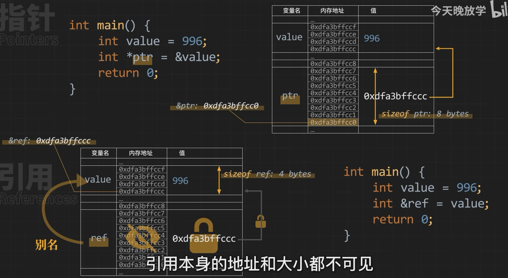

## C++ 引用

引用变量是一个别名，也就是说，它是某个已存在变量的另一个名字。一旦把引用初始化为某个变量，就可以使用该引用名称或变量名称来指向变量。

引用本身并不占用额外的内存空间，但它所引用的对象仍然占用内存空间。



#### C++ 引用 vs 指针
引用很容易与指针混淆，它们之间有三个主要的不同：

* 不存在空引用。引用必须连接到一块合法的内存。
* 一旦引用被初始化为一个对象，就不能被指向到另一个对象。指针可以在任何时候指向到另一个对象。
* 引用必须在创建时被初始化。指针可以在任何时间被初始化。

#### C++ 中创建引用
试想变量名称是变量附属在内存位置中的标签，您可以把引用当成是变量附属在内存位置中的第二个标签。因此，您可以通过原始变量名称或引用来访问变量的内容。例如：
```cpp
int i = 17;
```
我们可以为 i 声明引用变量，如下所示：
```cpp
int&  r = i;
double& s = d;
```
在这些声明中，& 读作引用。因此，第一个声明可以读作 "r 是一个初始化为 i 的整型引用"，第二个声明可以读作 "s 是一个初始化为 d 的 double 型引用"。下面的实例使用了 int 和 double 引用：
```cpp
#include <iostream>
 
using namespace std;
 
int main ()
{
   // 声明简单的变量
   int    i;
   double d;
 
   // 声明引用变量
   int&    r = i;
   double& s = d;
   
   i = 5;
   cout << "Value of i : " << i << endl;
   cout << "Value of i reference : " << r  << endl;
 
   d = 11.7;
   cout << "Value of d : " << d << endl;
   cout << "Value of d reference : " << s  << endl;
   
   return 0;
}
```
上面代码编译运行结果：
> Value of i : 5
> Value of i reference : 5
> Value of d : 11.7
> Value of d reference : 11.7

#### 引用与常量
将一个引用设置为常量后，不能通过该引用修改数据，但仍可通过被引用的变量来改变。如下所示：
```cpp
int a = 100;
const int & b = a;//b和a是同一内存，但不能直接修改b
b = 1000;//错误
a = 1000;//正确
```
被引用的数据是常量，引用本身也必须是常量：
```cpp
const int a = 100;
const int &b = a;//OK
int &b = a;//error
int &ra = 10;//error
const &ra = 10;//OK
```


#### 引用的特点
引用在 C++ 中具有以下特点：

1. 别名：引用是变量的别名。通过引用，我们可以使用另一个名称来访问同一内存位置上的数据。

2. 指向不可变：一旦引用绑定到了某个对象，它将一直指向该对象，并不能被重新绑定到其他对象。因此，引用本身是一个常量。

3. 间接操作：通过引用，可以直接操作原变量。对引用所做的任何修改都会反映到原变量上，也可以通过引用读取和修改原变量的值。

4. 安全性：引用提供了更安全的访问方式。在使用引用时，不会出现空指针问题，因为必须在声明时就进行初始化。

5. 简洁性：引用可以简化对变量的操作和传递。它提供了一种更简洁的语法，使得代码更加易读和易理解。

6. 无需额外内存：引用本身不占用额外的内存空间，它与被引用对象共享相同的内存空间。

7. 适用于函数参数传递：通过引用作为函数参数，可以实现对传入实参的直接修改，而无需使用指针。

引用是 C++ 提供的一个重要特性，它可以增加代码的可读性，并提供了一种方便而直接的访问和修改对象的方式。引用的正确使用可以提高代码的效率和安全性。

#### 引用的应用

**引用通常用于函数参数列表和函数返回值。**

1. 参数传递：通过将引用作为函数的参数，可以直接修改原始对象，而不是通过副本进行操作。这可以提高性能，避免内存开销，并使代码更加清晰可读。
   
下面是一个示例：
```cpp
#include <iostream>
using namespace std;
 
// 函数声明
void swap(int& x, int& y);
 
int main ()
{
   // 局部变量声明
   int a = 100;
   int b = 200;
 
   cout << "交换前，a 的值：" << a << endl;
   cout << "交换前，b 的值：" << b << endl;
 
   /* 调用函数来交换值 */
   swap(a, b);
 
   cout << "交换后，a 的值：" << a << endl;
   cout << "交换后，b 的值：" << b << endl;
 
   return 0;
}
 
// 函数定义
void swap(int& x, int& y)
{
   int temp;
   temp = x; /* 保存地址 x 的值 */
   x = y;    /* 把 y 赋值给 x */
   y = temp; /* 把 x 赋值给 y  */
  
   return;
}
```
当上面的代码被编译和执行时，它会产生下列结果：
```bash
交换前，a 的值： 100
交换前，b 的值： 200
交换后，a 的值： 200
交换后，b 的值： 100
```

2. 函数返回值：函数可以返回引用类型，以便在函数调用结束后继续对返回的对象进行操作。这样可以避免对象副本的构造和内存分配，提高效率。
   
下面是一个函数返回值是引用的示例：
```cpp
#include <iostream>
 
using namespace std;
 
double vals[] = {10.1, 12.6, 33.1, 24.1, 50.0};
 
double& setValues(int i) {  
   double& ref = vals[i];    
   return ref;   // 返回第 i 个元素的引用，ref 是一个引用变量，ref 引用 vals[i]
 
 
}
 
// 要调用上面定义函数的主函数
int main ()
{
 
   cout << "改变前的值" << endl;
   for ( int i = 0; i < 5; i++ )
   {
       cout << "vals[" << i << "] = ";
       cout << vals[i] << endl;
   }
 
   setValues(1) = 20.23; // 改变第 2 个元素
   setValues(3) = 70.8;  // 改变第 4 个元素
 
   cout << "改变后的值" << endl;
   for ( int i = 0; i < 5; i++ )
   {
       cout << "vals[" << i << "] = ";
       cout << vals[i] << endl;
   }
   return 0;
}
```
编译结果：
```bash
改变前的值
vals[0] = 10.1
vals[1] = 12.6
vals[2] = 33.1
vals[3] = 24.1
vals[4] = 50
改变后的值
vals[0] = 10.1
vals[1] = 20.23
vals[2] = 33.1
vals[3] = 70.8
vals[4] = 50
```
**注意**：当返回一个引用时，要注意被引用的对象不能超出作用域。所以返回一个对局部变量的引用是不合法的，但是，可以返回一个对静态变量的引用。

```cpp
int& func() {
   int q;
   //! return q; // 在编译时发生错误
   static int x;
   return x;     // 安全，x 在函数作用域外依然是有效的
}
```
**注意**：如果一个函数的返回值是一个引用，那么函数可以调用可以作为 `=` 的左值
```cpp
func() = 100;// 可以直接对引用进行赋值，从而修改被引用的对象
```
**引用的其他应用**
- C++ 中引用的应用广泛，下面是引用的其他应用场景：
  * 1. 容器迭代器：使用引用可以方便地遍历和修改容器中的元素，改变元素的值或状态。
  * 2. 解构多重赋值：通过使用引用，可以在一条语句中同时给多个变量赋值。
  * 3. 别名定义：引用可以用于定义别名，提供更直观和易懂的命名方式。
  * 4. 传递大型对象：当需要传递大型对象时，使用引用而不是拷贝可以避免不必要的内存开销和执行时间。
  * 5. 操作符重载：引用经常用于实现操作符的重载，实现自定义的类行为。
  * 6. 对象排除空指针：使用引用可以确保对象的有效性，避免意外地处理空指针的情况。
  * 7. 与 STL 算法结合使用：STL 算法通常利用迭代器进行操作，而引用可以更方便地与迭代器一起使用。

引用作为 C++ 的重要特性之一，提供了诸多便利和灵活性，可以用于改善代码的性能、可读性和可维护性。通过合理使用引用，我们能够更好地编写高效、简洁和易于理解的代码。

#### 引用的特殊情况
引用在特殊情况下可能会出现一些特殊行为，以下是其中几种常见的特殊情况：

1. 空引用（Null reference）：引用不能指向空值或无效的对象。在创建引用时，必须将其初始化为有效的对象。如果试图将引用绑定到空指针或未初始化的对象上，会导致编译错误。

2. 引用生命周期延长：当一个引用作为函数的返回值时，其生命周期会延长到函数被调用的地方。这意味着可以使用函数返回的引用来修改或访问原始对象。

3. 作为数组元素：C++ 允许将引用作为数组的元素，但是需要注意，引用的绑定不可变。在声明数组时，引用必须初始化为某个对象，并且无法重新绑定到其他对象。

4. 引用和常量：引用可以视为常量，即一旦引用绑定到一个对象后，无法再重新绑定到其他对象。通过声明引用为 `const` 类型，可以进一步确保引用指向的对象不被修改。

5. 相互引用：两个对象之间可以相互引用对方，形成相互依赖的关系。这种情况下，在销毁其中一个对象时，另一个对象的引用可能会变得无效。要避免悬空引用，应谨慎处理相互引用的情况。

6. 引用与指针：C++ 中的引用和指针类似，但有着不同的行为和语义。引用必须在声明时进行初始化，而指针可以在任何时候指向不同的对象。此外，引用没有自己的内存地址，而指针具有自己的内存地址。

这些特殊情况展示了引用的一些特殊行为和限制。了解这些情况对于正确使用引用非常重要，以避免错误和不确定性。

##### 悬垂引用

当一个引用指向了已经被销毁的对象或超出了其作用域的对象时，就会出现悬垂引用。下面是一个示例：

```cpp
int& danglingReference() {
    int x = 5;
    int& ref = x; // 引用指向局部变量 x
    return ref;  // 返回引用
} // x 的作用域结束，x 被销毁

int main() {
    int& result = danglingReference(); // 获取返回的引用
    // 在这里使用引用 result，访问已经被销毁的 x
    std::cout << result << std::endl; // 可能输出无效的值，因为 x 已被销毁
    
    return 0;
}
```

在上述代码中，`danglingReference()` 函数返回了一个指向局部变量 `x` 的引用 `ref`。然而，当函数执行完毕后，`x` 的生命周期结束，`ref` 引用的对象变成了无效的。在 `main()` 函数中，我们尝试使用 `result` 引用来访问 `x`，但由于 `x` 已经不存在，这将导致未定义行为。

悬垂引用是非常危险的，因为它们可以产生难以调试的错误。因此，在编写代码时，务必注意避免返回或使用悬垂引用。