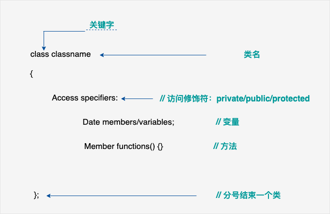

## 类

面向对象编程的三大核心基本思想： **类的封装，继承和派生，多态**

#### 一、类的概念

类用于指定对象的形式，是一种用户自定义的数据类型，它是一种封装了数据和函数的组合。类中的数据称为成员变量，函数称为成员函数。类可以被看作是一种模板，可以用来创建具有相同属性和行为的多个对象。

类（Class）：
- 类是一种自定义的数据类型，用于表示具有相似属性和行为的一组对象。
- 类是对象的模板或蓝图，它定义了对象的共同特征和行为。它包括数据成员（属性）和成员函数（方法）。
- 通过实例化（创建对象）类，可以使用类中定义的属性和方法。

对象（Object）：
- 对象是类的一个实例，是类的具体化表现。
- 对象拥有类中定义的属性和行为，可以对其进行操作和访问。
- 每个对象都是独立的，具有自己的状态（由类中的属性确定）和行为（由类中的方法决定）。

类和对象之间的关系：
- 类是对象的模板，而对象是类的具体实例。
- 类可以看作是一个抽象的概念，描述了对象应该有的属性和行为。
- 对象是类的具体化，通过实例化类来创建对象，使得对象能够存储具体的数据，并能执行类中定义的操作。

#### 二、类的定义
定义一个类需要使用关键字 class，然后指定类的名称，并类的主体是包含在一对花括号中，主体包含类的成员变量和成员函数。

定义一个类，本质上是定义一个数据类型的蓝图，它定义了类的对象包括了什么，以及可以在这个对象上执行哪些操作。



##### 类成员权限限定符

- 公有（public）成员：任何地方都可以访问。

- 保护（protected）成员：只能在本类域和及其后代类域中访问。

- 私有（private）成员：只能在本类域内部访问。在类内部访问(类默认的成员权限是private)

##### 类的对象

类提供了对象的蓝图，所以基本上，对象是根据类来创建的。声明类的对象，就像声明基本类型的变量一样。下面的语句声明了类 Car 的两个对象：
```cpp
    // 创建两个 Car 类的对象
    Car myCar1;// 声明 myCar1，类型Car
    Car myCar2;// 声明 myCar2，类型Car
```

##### 访问数据成员

类的对象的公共数据成员可以使用直接成员访问运算符` . `来访问。

示例代码：

```cpp
// 定义一个简单的类
class Car {
public:
    // 属性
    std::string brand;
    int year;

    // 方法
    void startEngine() {
        std::cout << "Engine started!" << std::endl;
    }

    void stopEngine() {
        std::cout << "Engine stopped!" << std::endl;
    }
};

int main() {
    // 创建两个 Car 类的对象
    Car myCar1;// 声明 myCar1，类型Car
    Car myCar2;// 声明 myCar2，类型Car

    // 使用对象的属性和方法
    myCar1.brand = "Toyota";
    myCar1.year = 2020;
    myCar1.startEngine();

    myCar2.brand = "BMW";
    myCar2.year = 2018;
    myCar2.stopEngine();

    return 0;
}
```

在上述示例中，定义了一个名为 `Car` 的类，它具有品牌（`brand`）和年份（`year`）这两个属性，以及启动引擎（`startEngine`）和停止引擎（`stopEngine`）这两个方法。然后通过创建 `Car` 类的对象 `myCar1` 和 `myCar2`，可以分别访问并操作这些对象的属性和方法。

总结而言，类是一种自定义的数据类型，用于描述具有相同属性和行为的一组对象。对象是类的实例，拥有类定义的属性和方法。通过实例化类来创建对象，并使用对象来访问和操作类的成员。

#### 三、类的空间内存大小

类本身是一种数据类型，在没有定义对象前是不占用内存空间的，定义对象的时候才会分配空间 。
类的定义描述了对象所具有的属性和行为，它们是在运行时使用类来实例化对象时的模板或蓝图。类本身仅仅是一个逻辑抽象的概念，并不需要分配实际的内存空间。

当我们创建一个类的对象时，系统会根据类的定义分配相应的内存空间来存储对象的成员变量（属性）和方法（行为）。每个对象都有自己独立的内存空间，其中包含了类定义中所声明的各个成员。

-----------------------------------------------------------------------

类的空间大小取决于其成员变量和内存对齐规则。可以通过以下步骤计算一个类的空间大小：

1. 确定每个成员变量的大小：根据其数据类型，确定每个成员变量占用的内存大小。例如，`int` 类型通常占用 4 字节，`double` 类型通常占用 8 字节。

2. 添加成员变量的大小：将每个成员变量的大小相加，得到类中所有成员变量的总大小。

3. 填充额外的字节：为了满足内存对齐要求，编译器可能在成员变量之间插入一些额外的字节。这些额外的字节称为填充（padding）或对齐（alignment）字节。

   - 内存对齐是处理器访问内存的方式，要求某些数据类型从特定地址开始存储。
   - 常见的对齐规则是以该数据类型的字节数作为对齐基准，保证变量在地址处于该基准的倍数上。
   - 对齐规则可以提高访问速度并优化内存使用。

4. 计算总大小：将成员变量的总大小与填充字节相加，得到类的总空间大小。

5.  如果一个类中没有数据成员(空类)，也没有虚表，那么这个类的大小规定为1个字节 

示例代码：

```cpp
class MyClass {
public:
    int num;
    double value;
    char ch;
};

int main() {
    std::cout << "Size of MyClass: " << sizeof(MyClass) << " bytes" << std::endl;
    return 0;
}
```
运算结果：
```cpp
Size of MyClass: 24 bytes
```

请注意，类的实际大小可能大于其成员变量的累计大小，因为编译器会根据对齐规则进行填充字节。具体的对齐规则因编译器、操作系统和数据类型而异。可使用 `#pragma pack(n)` 或 `__attribute__((packed))` 等指令来调整结构体或类的对齐方式。

总结而言，类的空间大小取决于其成员变量的大小以及编译器使用的内存对齐规则。通过计算每个成员变量的大小并考虑对齐要求，可以估算类的总空间大小。

##### 为什么空类的大小是1个字节 ? ?

这样做是为了确保每个对象有唯一的地址。
即使一个类没有定义任何成员变量，仍然需要占用一些内存空间。这是因为在C++中，每个对象在内存中都要占据至少一个字节的存储空间。这个字节用于标识该对象的存在，以便能够在内存中独立地访问它。
当一个类为空时，编译器会插入一个字节的填充以确保对象具有唯一的地址。这也可以避免某些问题，比如如果两个相同类型的空对象位于相同的地址上，则无法区分它们。

-----------------------------------------------------------------------

#### 四、构造函数

构造函数是一种特殊的成员函数，**用于创建和初始化类的对象**。它在对象创建时自动调用，并负责将对象的成员变量设置为有效的初始值。

**作用：**
- 构造函数用于在对象创建时执行必要的初始化操作，确保对象正确地初始化为可用状态。
- 它可以接受参数，并使用这些参数来初始化对象的成员变量。
- 构造函数还可以执行其他任意操作，如分配动态内存、打开文件等。

**语法规则：**
- 构造函数的名称与类的名称相同。
- 构造函数没有返回类型（包括 void），因为构造函数不返回任何值。
- 构造函数可以重载，即可以有多个构造函数，只需根据参数列表的不同进行区分。

**特点：**
- 构造函数在对象创建时自动调用，无需显式调用。
- 将构造函数定义为共有（public），以便在类外部或派生类中可以访问和调用。
- 每个类至少有一个构造函数。**如果没有显式地定义构造函数，编译器会提供一个默认的无参构造函数。**
- 通过在类中定义构造函数，可以控制对象的创建过程，维护对象的初始化正确性。
- 构造函数可以**具有不同的参数和重载形式**，以适应不同的对象创建需求。

##### 构造函数的调用顺序是通过创建对象时的继承关系来确定的。在派生类中，构造函数的调用顺序是从基类到派生类的顺序。

具体来说：

- 首先，首先调用基类的构造函数。
- 然后，按照基类声明的顺序依次调用每个成员变量的构造函数。
- 最后，调用派生类自身的构造函数。

在多重继承的情况下，将按照继承声明的顺序进行构造函数的调用。每个基类都会在派生类的构造函数中被初始化。

当派生类的构造函数执行完毕后，逆序地调用各个基类的析构函数，再调用派生类自身的析构函数。

示例代码：

```cpp
class MyClass {
public:
    int num;
    double value;

    // 默认构造函数
    MyClass() {
        num = 0;
        value = 0.0;
    }

    // 带参数的构造函数
    MyClass(int n, double v) {
        num = n;
        value = v;
    }
};

int main() {
    // 创建类对象时自动调用构造函数进行初始化
    MyClass obj1;              // 调用默认构造函数
    MyClass obj2(10, 3.14);     // 调用带参数的构造函数

    std::cout << "obj1: num - " << obj1.num << ", value - " << obj1.value << std::endl;
    std::cout << "obj2: num - " << obj2.num << ", value - " << obj2.value << std::endl;

    return 0;
}
```
运行结果：
```cpp
obj1: num - 0, value - 0
obj2: num - 10, value - 3.14
```

总结而言，构造函数是一种特殊的成员函数，用于在对象创建时执行必要的初始化操作。它没有返回类型，其名称与类名称相同。构造函数在对象创建时自动调用，可以有不同的参数和重载形式，并用于初始化对象的成员变量。

##### 构造函数常见的写法

* 第一：无参构造函数

```cpp
Animal()
```

* 第二：带参数的构造函数
* 
    参数的类型以及个数没有任何限制，只要是合法的参数类型都可以作为构造函数的形参

* 第三：带默认参数的构造函数
  
> 注意：这种版本的构造函数容易跟其它版本的构造函数起冲突
      这种版本的构造函数如果你定义在类的外面，默认参数不要写了
```cpp
class Cat
{
 public:
      Cat(int _age=5);

};
Cat::Cat(int _age) //定义在类的外面不要写默认参数了
{

}
```
* 第四：带参数列表的构造函数
      注意：这种版本的构造函数如果你定义在类的外面，需要这么写
```cpp
class Animal
{
public:
    Animal(int _age); //声明的时候不要写成参数列表
private:
    int age;
    // 其他类 对象obj;
};

Animal::Animal(int _age):age(_age) //定义的时候写成参数列表
{
cout<<"构造函数"<<endl;
}
```

* 第五：指定父类的构造函数(继承和派生)
> 子类指定父类的构造函数
```cpp
子类构造(形参列表):父类构造(传递给父类的实参)
{

}
```

-----------------------------------------------------------------------

#### 析构函数

类的析构函数是类的一种特殊的成员函数，它会在每次删除所创建的对象时执行。

析构函数的名称与类的名称是完全相同的，只是在前面加了个波浪号（~）作为前缀，它不会返回任何值，也不能带有任何参数。析构函数有助于在跳出程序（比如关闭文件、释放内存等）前释放资源。
```cpp
~类名()
{
        代码
}
```

**作用：**
- 析构函数用于在对象销毁时执行必要的清理操作，例如释放动态分配的内存、关闭文件等。
- 它可以确保对象正确地释放其所拥有的资源。

**语法规则：**
- 析构函数的名称与类的名称相同，前面加上波浪线（`~`）作为前缀。
- 析构函数没有返回类型（包括 `void`），因为它**不返回任何值**。
- 每个类只能有一个析构函数。
- 析构函数无需显式调用，在对象销毁时自动由编译器调用。

**特点：**
- 析构函数在对象销毁时自动调用，无需手动调用。
- 将析构函数定义为公有（`public`），以便在类外部或派生类中可以访问和调用。
- 一个类中如果**没有显式地定义析构函数**，编译器会提供一个**默认的析构函数**，它执行的是默认的析构行为。
- 析构函数逆序地按照构造函数创建对象时的顺序进行调用，即最后创建的对象先被销毁。

示例代码：

```cpp
class MyClass {
public:
    int* dynamicArray;

    // 构造函数
    MyClass() {
        dynamicArray = new int[10];
    }

    // 析构函数
    ~MyClass() {
        delete[] dynamicArray;
    }
};

int main() {
    MyClass obj;  // 创建对象时自动调用构造函数

    // 使用对象...

    // 对象销毁时自动调用析构函数，释放资源
    return 0;
}
```

在上述示例中，定义了一个名为 `MyClass` 的类，并声明了一个成员变量 `dynamicArray`，它是指向动态分配的整数数组的指针。在类的构造函数中，我们使用 `new` 运算符动态地为 `dynamicArray` 分配了内存。在析构函数中，我们使用 `delete[]` 运算符释放了之前分配的内存。

-----------------------------------------------------------------------

#### 五、this指针

this 指针是一个特殊的指针，在 C++ 中用于表示当前对象的地址。它是类的非静态成员函数中的一个隐含参数，指向正在被调用的成员函数所属的对象。

this 指针的作用有以下几个方面：

* 在成员函数内部，可以使用 this 指针来引用当前对象的成员变量和成员函数。
* 通过 this 指针，可以区分调用相同名称的局部变量和成员变量。
* 当类的成员函数被调用时，编译器会自动将当前对象的地址传递给 this 指针。

-----------------------------------------------------------------------

#### 六、拷贝构造函数

拷贝构造函数是一个特殊的构造函数，用于创建一个新对象并将其初始化为与现有对象相同的值。它通常使用另一个同类对象作为参数，并根据该对象的值创建新对象。

**作用：**
- 通过使用另一个同类型的对象来初始化新创建的对象。

- 复制对象把它作为参数传递给函数。

- 复制对象，并从函数返回这个对象。

**规则：**

- 拷贝构造函数的名称与类的名称相同。
- 在需要进行拷贝构造的情况下，编译器会自动调用合适的拷贝构造函数，默认或用户自定义的。
- 如果没有显式地定义拷贝构造函数，编译器会提供一个默认的拷贝构造函数，执行浅层复制（即简单地复制成员变量的值）。
- 拷贝构造函数通常通过引用传递参数，以便避免对象的副本生成和额外的内存开销。
- 如果类带有指针变量，并有动态内存分配，则它必须有一个拷贝构造函数。

**特点：**
- 拷贝构造函数用于创建一个新对象，并将其初始化为与现有对象相同的值。
- 它在对象的创建过程中自动调用，无需手动调用。
- 当需要复制对象时，拷贝构造函数可以被隐式地调用。
- 拷贝构造函数常用来处理对象的深层复制（即复制对象及其动态分配的资源，而不仅仅是成员变量的值）。

示例代码：

```cpp
class MyClass {
public:
    int value;

    // 默认构造函数
    MyClass() {
        value = 0;
    }

    // 拷贝构造函数
    MyClass(const MyClass& other) {
        value = other.value;
    }
};

int main() {
    MyClass obj1;
    obj1.value = 100;

    MyClass obj2(obj1);  // 使用拷贝构造函数创建新对象，并将其初始化为obj1的值

    std::cout << "obj1: value - " << obj1.value << std::endl;
    std::cout << "obj2: value - " << obj2.value << std::endl;

    return 0;
}
```
输出将显示两个对象的 `value` 成员变量都是相同的值。


#### 深拷贝和浅拷贝的区别
浅拷贝：只拷贝对象本身空间里面的内容，编译器默认生成的拷贝构造函数就是 浅拷贝
深拷贝：拷贝对象本身空间内容的同时，还要分配成员指向的堆空间并且进行拷贝

示例：
```cpp
#include <iostream>
#include <cstring>

using namespace std;

class Student
{
public:
    Student() {}
    Student(const char *name, int age)
    {
        this->name = new char[256]; // 在构造函数中申请空间
        strcpy(this->name, name);
        this->age = age;

        cout << "Student(const char*name,int age)" << endl;
    }
    ~Student() // 析构 浅拷贝析构的时候会出现double free的情况
    {
        cout << "~Student()" << endl;
        delete[] name;
    }
// 如果我们没有自己定义拷贝构造函数，编译器默认就会为我们生成 一个 值的拷贝构造函数
#if 0
    Student(const Student &other)  //Student &other = s1
    {
        //值的拷贝
        this->name = other.name;
        this->age = other.age;

        cout<<"Student(const Student &other)"<<endl;
    }
#endif

    // 如果此时 该类中 有指针成员 ，需要申请内存空间的时候  需要自己定义一个 深拷贝构造函数
    // 深度拷贝：不仅仅 拷贝 对象的内存空间的数据 ，也为指针成员申请内存空间
    Student(const Student &other)
    {
        this->name = new char[256];

        strcpy(this->name, other.name);
        this->age = other.age;

        cout << "Student(const Student &other)" << endl;
    }

    void printInfo()
    {
        // cout<<"name:"<<name<<endl; //static_cast<const void *>显示类型转换
        cout << "name: " << name << "\t"
             << "addr: " << static_cast<const void *>(name) << endl;
    }

    void setName(const char *name)
    {
        strcpy(this->name, name);
    }

private:
    char *name; // 指针变量
    int age;
};

int main()
{
    // 实例化一个对象
    Student s1("张3", 22);
    s1.printInfo();

    // 当创建对象的时候 ，通过另一个对象来初始化 调用拷贝构造函数
    Student s2(s1); // 拷贝构造函数的作用
    s2.printInfo();

    // s2.setName("li4");
    // s2.printInfo();

    return 0;
}

```


