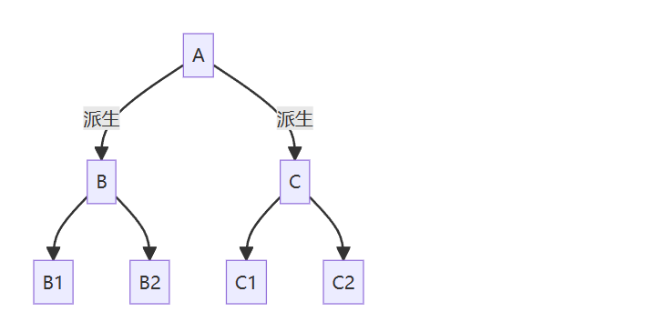
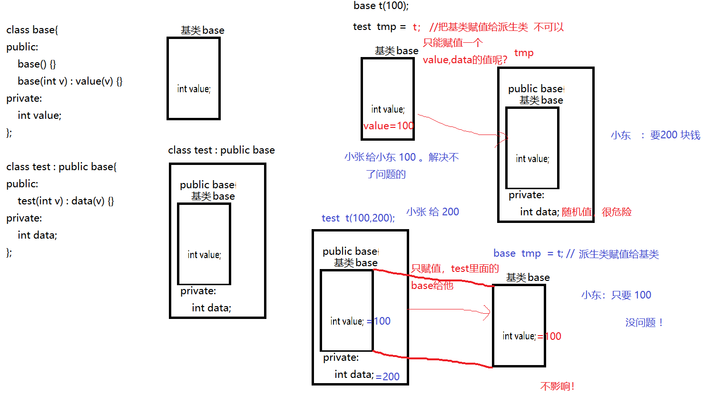

##  类的构造和析构

### 1. 类继承中的构造
类的继承关系中，父类也称为基类，因此类似于地基，盖房子必先有地基，然后才有高楼。因此很容易可以得出结论：

* 构造子类对象时，会自动先调用父类的构造函数
* 若父类仍继承有其父类时，会自动调用父类的父类构造函数，以此类推。


### 2. 类继承中的析构
与构造类似，当析构一个对象时，就像拆除一栋房屋，必先拆除其上部，再拆其地基。因此很容易可以得出结论：

* 析构子类对象时，在执行完其析构函数后，会继续自动调用其基类的析构函数。
* 若基类仍有基类，则依照上述逻辑继续自动调用基类的基类的析构函数，以此类推。

示例：
```c++
class Base
{
public:
     Base(){cout << "构造基类" << endl;}
    ~Base(){cout << "析构基类" << endl;}
};

class Derived : public Base
{
public:
     Derived(){cout << "构造子类" << endl;}
    ~Derived(){cout << "析构子类" << endl;}
};

int main(int argc, char const *argv[])
{
    Derived d;

    return 0;
}
```
运行结果：
```text
构造基类
构造子类
析构子类
析构基类
```


### 继承的赋值问题

#### 同族类类型转换

所谓的同族类类型，指的是拥有共同祖先类的各代类类型（不包含多重继承情形），比如


在上述派生关系中，代际之间的类型转换称为同族类类型转换，这种代际之间的类型转化有两种情况：

- 指针或引用类型从后代类转向祖先类，称为向上转换（upcasting），比如从 `B` 到 `A`
- 指针或引用类型从祖先类转向后代类，称为向下转换（downcasting），比如从 `A` 到 `B`

##### 向上转换（upcasting）

在C++的语境中，以上类族中的A和B虽然是两种不同的类型，但由于B是A的子类，因此B必定包含A的所有内容，在内存上基类A是子类B的一部分（多出来的部分是子类B的个性化内容），因此一个子类的指针或引用被转成基类类型至少在内存是不会越界，在逻辑上也能说得通，毕竟凡是基类的属性或行为，子类都有访问的潜力。
```c++
class A
{
public:
    int x;
    void fa(){cout << __LINE__ << endl;}
};

class B : public A
{
public:
    int y;
    void fb(){cout << __LINE__ << endl;}
};

int main(int argc, char const *argv[])
{
    B b;

    A *pa = &b; // 将基类指针 pa 指向子类对象是安全的、可行的
    A &ra = b;  // 将基类引用 ra 指向子类对象是安全的、可行的

    pa->x = 100; // 可以访问对象b中的x
    pa->fa();    // 可以访问对象b中的fa()

    pa->y = 100; // 不可以访问对象b中的y，因为pa只能访问子类对象中的基类部分
    pa->fb();    // 不可以访问对象b中的fb()，因为pa只能访问子类对象中的基类部分

    return 0;
}
```

注意，在子类对象 `b` 中，包含了数据`x`、`y`，也包含了类方法`fa()`和`fb()`，但通过基类指针`pa`或引用`ra`只能访问到对象`b`中的`x`和`fa()`，这很容易理解。

__总结：__

- 向上转换是C++中经常看到的语法：用基类的指针或引用，指向子类对象，该过程是默认的，无需强制类型转换。
- 这个机制的最大用途是方便基类方法调用子类的虚函数，从而实现所谓多态。（该内容在后续会讲到）



#### 向下转换（downcasting）
相反，如果将子类的指针或引用指向基类对象，那么不管是从逻辑上还是从内存布局上，都存在不合理性：

- 逻辑上讲，子类是从基类派生出来的，因此子类可能存在基类不存在的属性或行为，因此不能用子类的指针或引用去操纵基类中不存在的属性或行为。
- 内存布局上讲，子类包含基类并超出基类，用子类的指针或引用操纵基类对象因此容易引发内存非法访问，导致程序崩溃。
```c++
class A
{
};

class B : public A
{
public:
    int x;
};

int main(int argc, char const *argv[])
{
    B *pb = new A; // 子类指针pb指向基类对象，是不允许的、不安全的

    return 0;
}
```

> 思考：
>基类和子类可以有重名的数据或类方法吗？如果可以，那么通过上述基类指针pa或引用ra访问到的究竟是基类的还是子类的版本呢？如果想访问另一个版本的数据或方法，可以做到吗？

基类和子类可以有重名的数据或类方法，它们属于各自的类域，因此不冲突，也不是重载。
但是此时隐藏了基类的接口，导致调用相同的函数时，只会调用子类的函数接口。

那么要想调用基类的函数接口，那么有以下方法:
- 1. 利用域操作符(名字空间引用符)
- 2. 利用基类的引用 显示隐藏的接口
- 3. 利用基类的指针 显示隐藏的接口

示例：
```c++
#include <iostream>

using namespace std;

class Base
{
private:
    int value;

public:
    void set_value(int val)
    {
        value = val;
    }
    void show_value()
    {
        cout << "Base::value = " << value << endl;
    }
};

class P_base : public Base
{
private:
    int value;

public:
    void set_value(int val)
    {
        value = val;
    }
    void show_value()
    {
        cout << "P_base::value = " << value << endl;
    }
};

int main(int argc, char *argv[])
{
    P_base temp;
    // 1.利用域操作符
    cout << "利用域操作符" << endl;
    temp.P_base::set_value(10);
    temp.P_base::show_value();

    temp.Base::set_value(20);
    temp.Base::show_value();

    // 2.利用基类的引用 显示隐藏的接口
    cout << "利用基类的引用 显示隐藏的接口" << endl;
    Base &a = temp;
    a.set_value(30);
    a.show_value();

    // 3.利用基类的指针 显示隐藏的接口
    cout << "利用基类的指针 显示隐藏的接口" << endl;
    Base *p = &temp;
    p->set_value(40);
    p->show_value();

}
```

