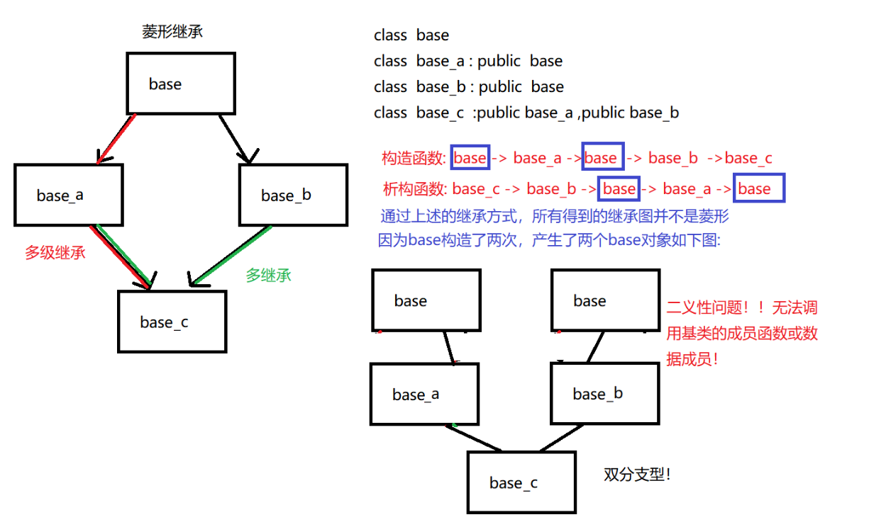
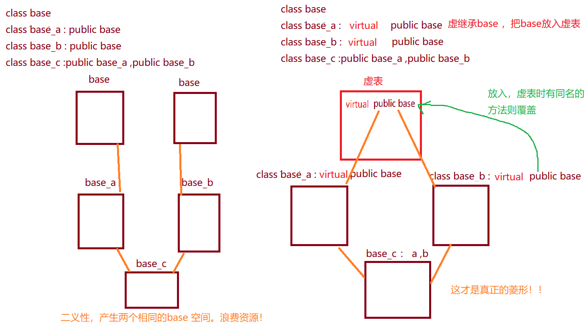

## 多级继承

多级继承是指一个派生类继承自另一个派生类，而这个派生类又继承自一个基类的继承方式。也就是说，一个派生类同时具有多个父类。

**特点：**
- 1. 多级继承可以实现多个基类的功能的复用，避免了代码的冗余。
- 2. 可以在派生类中访问所有父类的成员变量和成员函数。
- 3. 可以在派生类中对父类的成员进行重写或者扩展。

**作用：**
- 1. 实现多个类之间的关系和功能的组合。
- 2. 提高代码的复用性和可维护性。
- 3. 可以通过多级继承实现更加复杂的对象关系和功能。

**多级继承的应用：**
1. UI框架：在图形用户界面的开发中，可以通过多级继承来实现不同控件的组合和功能的扩展。
2. 游戏开发：游戏中的角色、武器、技能等可以通过多级继承来实现不同对象之间的关系和功能的组合。
3. 框架开发：在开发框架时，可以通过多级继承来实现不同模块的组合和功能的扩展。


## 多继承

多继承是指一个派生类同时继承自多个基类的继承方式。也就是说，一个派生类可以拥有多个直接基类。

**特点：**
1. 多继承可以实现多个基类的功能的复用，提高代码的复用性。
2. 可以在派生类中访问所有父类的成员变量和成员函数。
3. 可以在派生类中对父类的成员进行重写或者扩展。
4. 可以实现多个类之间的关系和功能的组合。

**作用：**
1. 实现不同类之间的关系和功能的组合。
2. 提高代码的复用性和可维护性。
3. 可以通过多继承实现更加复杂的对象关系和功能。

以下是一个简单的多继承的实例代码：

```cpp
#include <iostream>

class Base1 {
public:
    void func1() {
        std::cout << "Base1::func1()" << std::endl;
    }
};

class Base2 {
public:
    void func2() {
        std::cout << "Base2::func2()" << std::endl;
    }
};

class Derived : public Base1, public Base2 {
public:
    void func3() {
        std::cout << "Derived::func3()" << std::endl;
    }
};

int main() {
    Derived d;
    d.func1();  // 调用Base1的成员函数
    d.func2();  // 调用Base2的成员函数
    d.func3();  // 调用Derived的成员函数

    return 0;
}
```

在上述代码中，`Derived` 类同时继承自 `Base1` 和 `Base2`，可以分别调用它们的成员函数。

#### 多继承的构造和析构：
在多继承中，派生类的构造函数需要显式调用每个基类的构造函数，并按照继承的顺序进行初始化。析构函数的调用顺序与构造函数相反。

#### 多继承的参数列表初始化：
在多继承中，可以使用参数列表初始化来初始化每个基类的成员变量。例如：

```cpp
class Derived : public Base1, public Base2 {
public:
    Derived(int x, int y) : Base1(x), Base2(y) {
        // ...
    }
};
```

在上述代码中，派生类 `Derived` 使用参数列表初始化来初始化 `Base1` 和 `Base2` 的成员变量。


## 菱形继承

#### 菱形继承的概念

菱形继承是指一个派生类同时继承自两个直接或间接基类，并且这两个基类又继承自同一个基类的继承方式，形成了一个菱形的继承结构。


我们想要实现菱形继承，通过下面的代码实现：
```cpp
class base
class base_a : public base
class base_b : public base
class base_c : public base_a,public base_b
```
通过上述的继承方式，所得到的继承图不是菱形，因为base构造了两次，产生了两个base对象。如下图：



产生了二义性。

## 菱形继承的二义性问题


#### 产生原因 
例如，有一个基类Animal，两个派生类Cat和Dog分别继承自Animal，而派生类Tiger同时继承自Cat和Dog，这样就形成了一个菱形继承结构。

菱形继承的二义性问题产生原因是，派生类Tiger继承了Cat和Dog，而Cat和Dog又继承自Animal，这样在Tiger中就会存在两份来自Animal的成员变量和成员函数，导致二义性。

例如，如果Cat和Dog都有一个成员函数run()，那么在Tiger中调用run()时，就不知道应该调用Cat的run()还是Dog的run()，从而产生了二义性问题。

#### 解决方法

__1.利用域操作指定使用的接口__
```cpp
tmp.base_a::show();  //执行从 base_a::show 继承过来的show方法 
```
__2.在派生类中,重写同名的方法或成员,隐藏基类的接口__
```cpp
class base_c : public base_a, public base_b
{
public:
    void show() // 函数成员
    {
        cout << "show base_c " << endl;
    }
    int value; // 数据成员
};
```

__3.👍👍通过虚继承，把基类放入虚表，进行覆盖操作。__ 
```cpp
class  base 
class  base_a : virtual   public base 
class  base_b : virtual   public base 
class  base_c : public  base_a ,public  base_b 
```

使用虚继承时，派生类在继承共同基类时使用关键字`virtual`，这样就只会在派生类中保留一份共同基类的成员变量和成员函数，解决了二义性问题。




