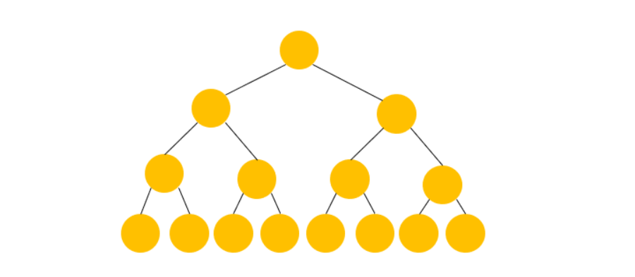
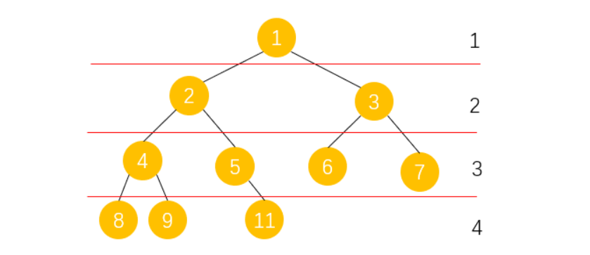
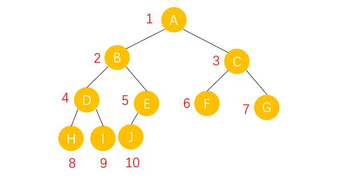

# 二叉树

### 二叉树的定义

二叉树（binary tree）是指树中节点的度不大于2的有序树，它是一种最简单且最重要的树。
二叉树的递归定义为：二叉树是一棵空树，或者是一棵由一个根节点和两棵互不相交的，分别称作根的左子树和右子树组成的非空树；左子树和右子树又同样都是二叉树。

每个结点最多有两棵子树，也就是度不大于2

### 二叉树的五种基本形态

1. 空二叉树
2. 只有一个根结点
3. 根结点只有左子树
4. 根结点只有右子树
5. 根结点既有左子树又有右子树

### 特殊的二叉树

__1. 满二叉树__：如果一棵树只有度为0的结点和度为2的结点，并且度为0的结点在同一层，则这棵树为满二叉树。


__2. 完全二叉树__：深度为k，有n个结点的二叉树当且仅当其每一个结点都与深度为k的满二叉树中编号从1到n的结点一一对应时，称为完全二叉树。

**完全二叉树的特点**是叶子结点只可能出现在层序最大的两层上，并且某个结点的左分支下子孙的最大层序与右分支下子孙的最大层序相等或大1


由于完全二叉树的n个结点，每一个结点都与深度为k的满二叉树中编号从1到n的结点一一对应，也就是编号一定要连续，例如下面这种情况就不是完全二叉树，因为编号为10的结点空掉了。


### 二叉树的性质


1. 二叉树的第i层上至多有 $2^i-1（i≥1）$个节点。
2. 深度为h的二叉树中至多含有$2^h -1$ 个节点
3. 若在任意一棵二叉树中，有 $n_0$个度为2的节点，则必有 $n_0 = n_2 + 1$
4. 具有n个节点的完全二叉树深为 $log_2x + 1(其中x表示不大于n的最大整数)$
5. 若对一棵有n个节点的完全二叉树进行顺序编号$(1 \le i \le n)$，那么，对于编号为$i(i \ge 1)$的节点:
   - (1)$i = 1$时，该节点为根，它无双亲节点 。
   - (2)$i > 1$时，该节点的双亲节点的编号为$i/2$ 。
   - (3)$2i \le n$，则有编号为$2i$的左节点，否则没有左节点 。
   - (4)$2i + 1 \le n$，则有编号为$2i+1$的右节点，否则没有右节点 。

### 二叉树的存储结构

#### 二叉树的顺序存储结构

二叉树的顺序存储结构就是用一维数组存储二叉树中的结点，并且结点的存储位置，也就是数组的下标要能体现结点之间的逻辑关系，比如双亲与孩子的关系，左右兄弟的关系等。

下面是完全二叉树的存储结构：



|下标|	1|	2|	3|	4|	5|	6|	7|	8|	9|	10|
|:---:|:---:|:---:|:---:|:---:|:---:|:---:|:---:|:---:|:---:|:---:|
|数据|	A|	B|	C|	D|	E|	F|	G|	H|	I|	J|

二叉树的链式存储结构
由于一个结点最多有两个孩子，那么对结构体的设计就变得简单很多，只需要包含一个数据域和两个指针域即可，我们称这样的链表为二叉链表：


lchild和rchild分别指向左孩子和右孩子
```c
//二叉链表结构体定义
typedef struct BiTNode
{
    TElemType data;  //数据域
    struct BiTNode *lchild,*rchild; //指针域
}BiTNode，*BiTree;
```
#### 遍历二叉树
遍历(***Traversal***)是指沿着某条搜索路线，依次对树中每个结点均做一次且仅做一次访问。


