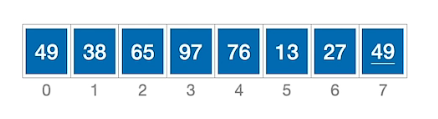
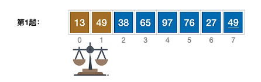
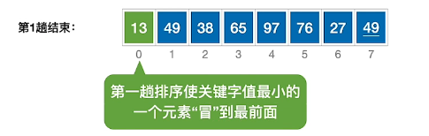
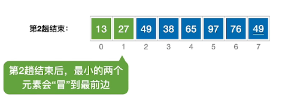
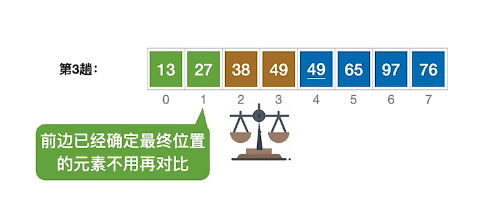
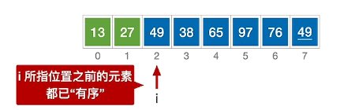
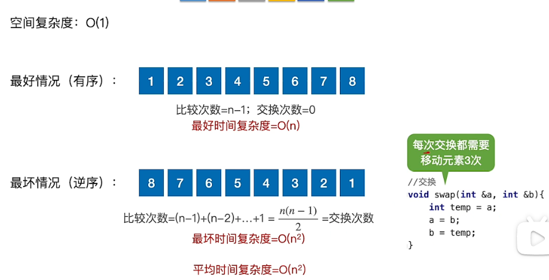
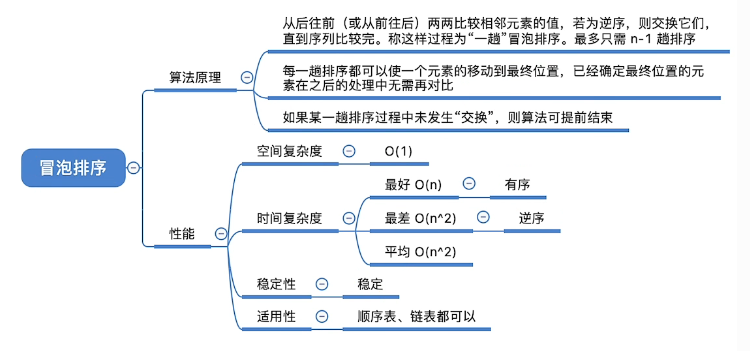

<!-- @import "[TOC]" {cmd="toc" depthFrom=1 depthTo=6 orderedList=false} -->

<!-- code_chunk_output -->

- [冒泡排序](#冒泡排序)
    - [冒泡排序的迭代](#冒泡排序的迭代)
    - [冒泡排序算法](#冒泡排序算法)
    - [算法性能分析](#算法性能分析)
    - [总结](#总结)
      - [冒泡排序算法实现](#冒泡排序算法实现)

<!-- /code_chunk_output -->


# 冒泡排序

冒泡排序（英语：Bubble Sort）又称为泡式排序，是一种简单的排序算法。它重复地走访过要排序的数列，一次比较两个元素，如果它们的顺序错误就把它们交换过来。走访数列的工作是重复地进行直到没有再需要交换，也就是说该数列已经排序完成。这个算法的名字由来是因为越小的元素会经由交换慢慢“浮”到数列的顶端。

比较相邻的两个元素然后交换这两者，一直到一整个数列都按照顺序排列。


从后往前（或从前往后)两两比较相邻元素的值，若为逆序(即A[i-1]>A[i])，则交换它们，直到序列比较完。称这样过程为“—趟”冒泡排序。

<div align="center">
  
</div>

________________________________________________________

### 冒泡排序的迭代
<div align="center">
  
</div>

<div align="center">
  
</div>

<div align="center">
  
</div>

<div align="center">
  
</div>

### 冒泡排序算法
```cpp
// 交换
void swap(int &a, int &b)
{
    int temp = a;
    a = b;
    b = temp;
}

// 冒泡排序
void BubbleSort(int A[], int n)
{
    for (int i = 0; i < n - 1; i++)
    {
        bool flag = false;              // 表示本趟冒泡是否发生交换的标志
        for (int j = n - 1; j > i; j--) // 一趟冒泡过程
        {
            if (A[j - 1] > A[j]) // 若为逆序
            {
                swap(A[j - 1], A[j]); // 交换
                flag = true;
            }
            if (flag == false)
            {
                return; // 本趟遍历后没有发生交换，说明表已经有序
            }
        }
    }
}

```

<div align="center">
  
</div>

_______________________________________________________

### 算法性能分析

<div align="center">
  
</div>

冒泡排序没有交换相同元素之间的相对位置，所以该算法是稳定的。


### 总结
<div align="center">
  
</div>

#### 冒泡排序算法实现
**c++**
```cpp
#include <iostream>
#include <cstdlib>
#include <ctime>

using namespace std;

int comp_count = 0; // 数据比较次数
int swap_count = 0; // 数据交换次数

void show(int data[], int len)
{
    int count = 0;
    for (int i = 0; i < len; i++)
    {
        cout << data[i] << "\t";
        count++;
        if (count == 10)
        {
            cout << endl;
            count = 0;
        }
    }
    cout << endl;
}

// 交换
void swap(int &a, int &b)
{
    swap_count++;
    int temp = a;
    a = b;
    b = temp;
}

// 冒泡排序
void BubbleSort(int A[], int n)
{
    for (int i = 0; i < n - 1; i++)
    {
        bool flag = false;              // 表示本趟冒泡是否发生交换的标志
        for (int j = n - 1; j > i; j--) // 一趟冒泡过程
        {
            comp_count++;
            if (A[j - 1] > A[j]) // 若为逆序
            {
                swap(A[j - 1], A[j]); // 交换
                flag = true;
            }
        }
        if (flag == false)
        {
            return; // 本趟遍历后没有发生交换，说明表已经有序
        }
    }
}

int main()
{
    srand(time(NULL));

    int data[100];
    for (int i = 0; i < 100; i++)
    {
        data[i] = rand() % 1000 + 1;
    }

    cout << "随机序列：" << endl;
    show(data, 100);

    BubbleSort(data, 100);

    cout << "排序后序列：" << endl;
    show(data, 100);

    cout << "总共比较次数：" << comp_count << endl;
    cout << "总共交换次数：" << swap_count << endl;
    cout << "交换元素的次数：" << swap_count * 3 << endl;
    return 0;
}

```
运算结果：
```bash
随机序列：
360     325     435     830     690     584     825     426     373     687
412     295     458     189     764     140     14      109     606     197
658     183     168     204     799     79      3       36      389     89
391     100     413     177     929     102     112     753     879     485
791     291     779     248     831     542     387     844     650     992
40      660     526     560     215     324     638     217     359     378
657     101     477     70      629     757     523     741     509     754
225     652     396     355     899     226     249     638     421     250
981     812     909     507     371     475     830     361     691     541
738     700     993     567     121     622     323     995     362     832

排序后序列：
3       14      36      40      70      79      89      100     101     102
109     112     121     140     168     177     183     189     197     204
215     217     225     226     248     249     250     291     295     323
324     325     355     359     360     361     362     371     373     378
387     389     391     396     412     413     421     426     435     458
475     477     485     507     509     523     526     541     542     560
567     584     606     622     629     638     638     650     652     657
658     660     687     690     691     700     738     741     753     754
757     764     779     791     799     812     825     830     830     831
832     844     879     899     909     929     981     992     993     995

总共比较次数：4845
总共交换次数：2085
交换元素的次数：6255

```
