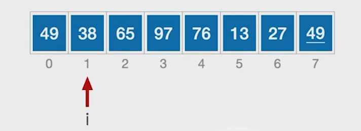
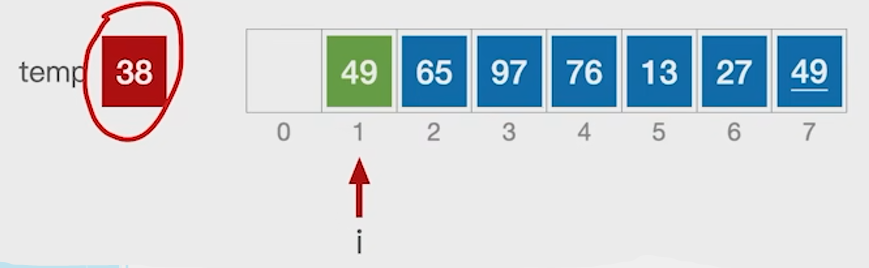
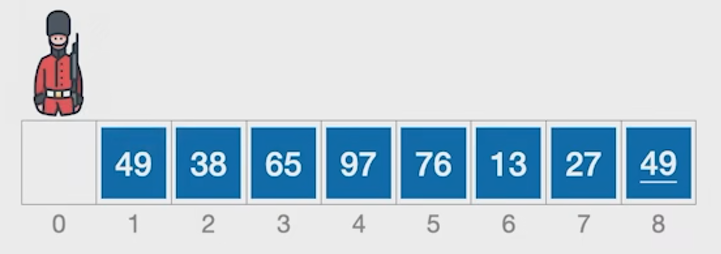
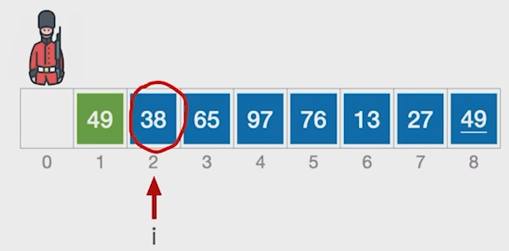
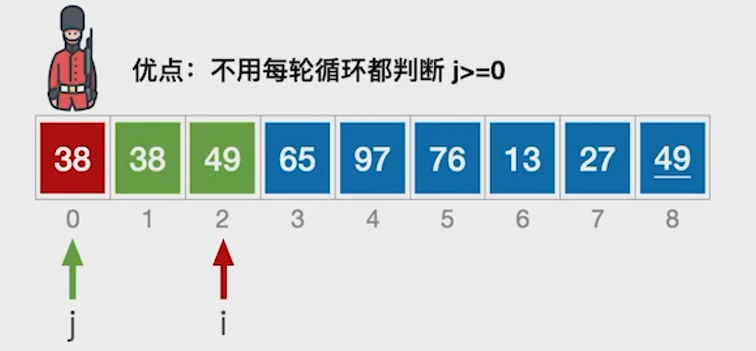
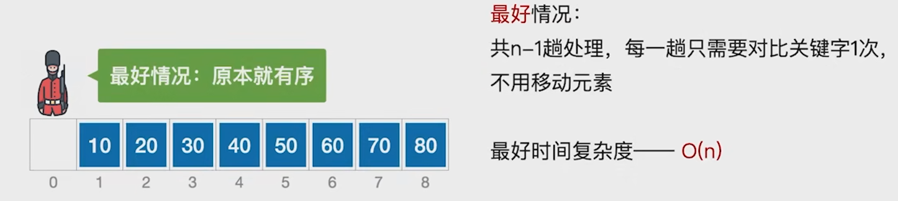
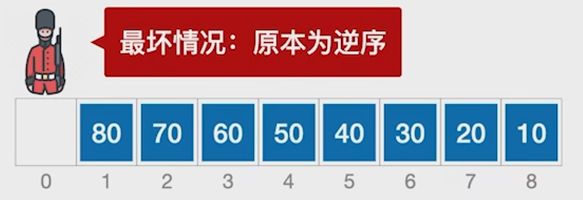
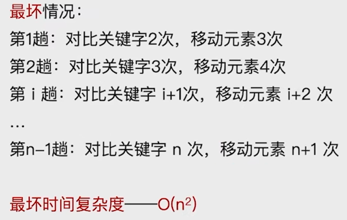
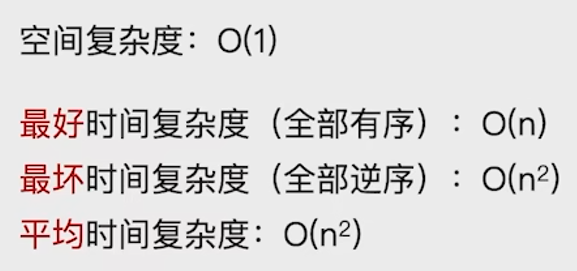

## 插入排序
算法思想：每次将一个待排序的记录按其关键字的大小插入到前面已排好的子序列中，直到全部记录插入完成。


算法实现

我们定义一个变量 `i` 指向当前需要插入到前边哪些序列的一个元素，只有当前处理的这个元素比它前边的这个元素更小的时候，我们才需要移动它前边的这个元素，所以我们会把当前 `i` 所指的元素，这个值用一个中间变量 `temp` 把它保存下来,这是为了防止移动元素的时候把原有的这个数据覆盖掉

到了第二层`for`循环，我们会从`i`的左边这个位置开始，依次往左检查它前边的这些元素是否要比38当前元素的值更大,所有比它更大的元素，我们都需要把它给右移，所以这个`for`循环导致的结果就是所有大于38的元素都会右移一位。

那每右移一位元素都会 `j -1`，当 `j < 0` 的时候，这个循环就会停止，所以最后我们还需要把之前保存下来的`temp`的值复制到插入的地方
```c
// 直接插入排序
void InsertSort(int A[], int n)
{
    int i, j, temp;
    for (i = 1; i < n; i++) // 将各元素插入已排好序的序列中
    {
        if (A[i] < A[i - 1]) // 若A[i] 关键字小于前驱
        {
            temp = A[i];                                // 用temp暂存A[i]
            for (j = i - 1; j >= 0 && A[j] > temp; --j) // 检查所有前面已排好序的元素
            {
                A[j + 1] = A[j]; // 所有大于temp的元素都向后挪位
            }
            A[j + 1] = temp; // 赋值到插入位置
        }
    }
}
```

### 直接插入排序(带哨兵)

**本质上的原理是跟上面的实现方式没有任何的区别**

和之前一样，只有当前指向的元素比它前边的元素要更小的时候，我们才需要移动它前边的这些元素，不过这次的实现方式是把处理的这个元素复制到`A[0]`这个位置，之前的是定义了一个`temp`变量来保存。到了第二层`for`循环，我们会检查当前所指的元素，比当前所指的元素更大的那些元素，我们都会把它右移一位，所以49比38更大，往右移一位，`j-1`，由于现在`j`所指的元素刚好指到了`A[0]`,就跳出了`for`循环，再把当前`A[0]`所指的元素把它复制到`j+1`这个位置

所以我们加了哨兵的好处就是，不用每轮循环还要判断一遍`j`是否大于等于 0 ,所以就会让我们这个循环执行的效率更高一点点，但是这个提升其实很小。

```c
void InsertSort(int A[], int n)
{
    int i, j;
    for (i = 2; i <= n; i++) // 依次将A[2] ~ A[n]插入到前面已排序序列
    {
        if (A[i] < A[i - 1]) // 若A[i]关键码小于前驱，将A[i]插入有序表
        {
            A[0] = A[i];                      // 复制为哨兵，A[0]不存放元素
            for (j = i - 1; A[0] < A[j]; --j) // 从后往前查找待插入位置
            {
                A[j + 1] = A[j]; // 向后挪位
            }
            A[j + 1] = A[0]; // 复制到插入位置
        }
    }
}
```
**算法的空间复杂度：O(1)**
定义的i，j，所有这些辅助变量所需的空间都是常数级的,和问题规模N没有任何关系。
**时间复杂度**
我们都是从第二个元素开始依次往后处理，那每一个元素都要进行这样的一轮`for`循环，所以我们要处理`n-1`个元素，也就是进行`n-1`躺处理，每一趟都要进行关键字的对比，也就是这个`if`判断，也有可能进行元素的移动，那么我们的时间复杂度的开销，其实就是来自这两个部分。

最好的情况：

最坏的情况：



