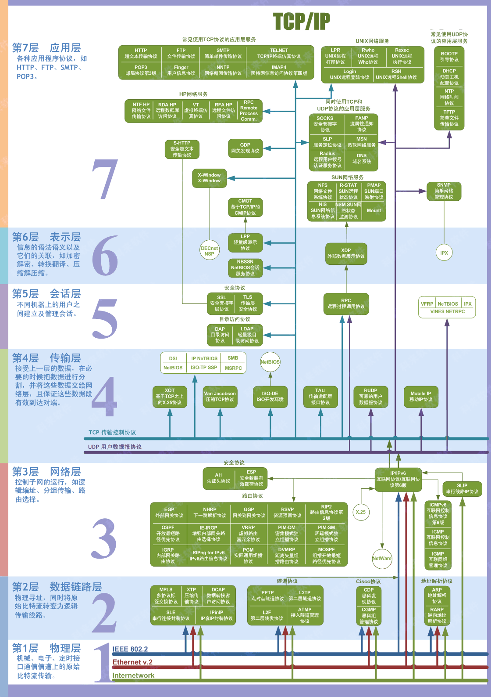
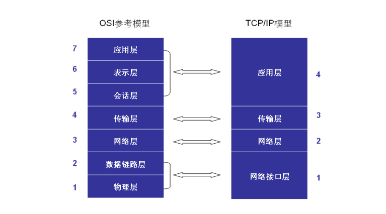
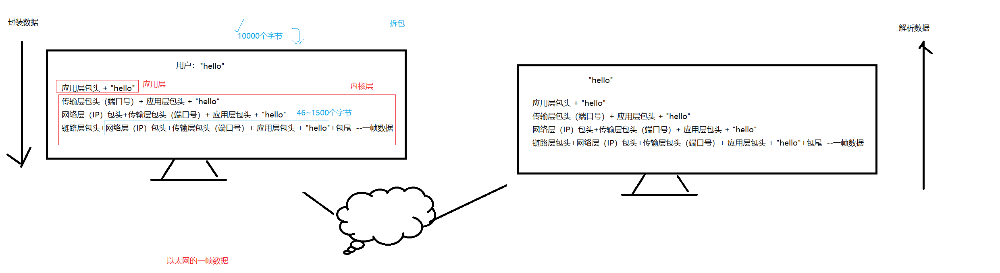
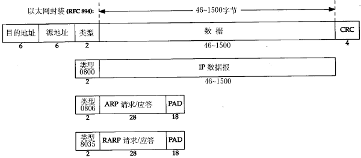
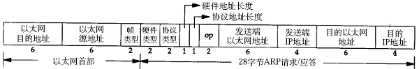
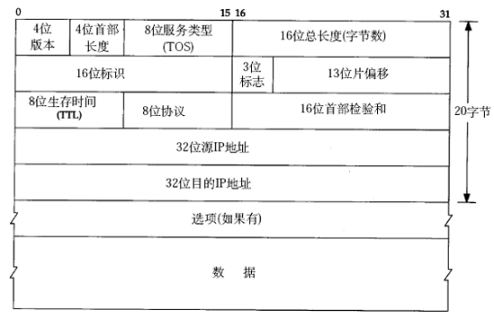
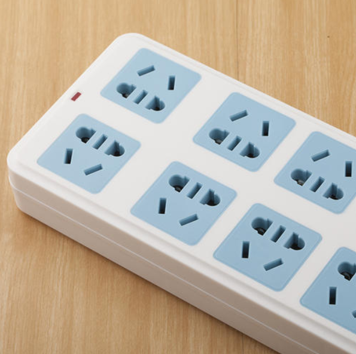
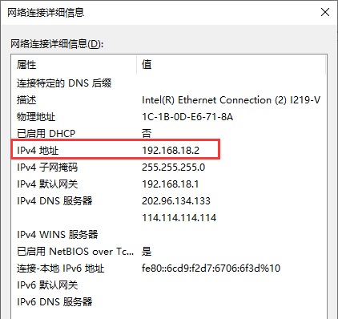

<!--
 * @Description: 
 * @version: 1.80.1
 * @Author: ZGG
 * @Date: 2023-08-10 14:43:42
 * @LastEditors: ZGG
 * @LastEditTime: 2023-08-18 09:06:25
-->
# 网络编程
## 协议（重点记忆）
#### 1.概念
应用的角度出发，在不同的主机之间通信，双方都必须遵循的同一种规则。协议可理解为“规则”，是数据传输和数据的解释的规则。
假设，A、B双方欲传输文件。规定：
第一次，传输文件名，接收方接收到文件名，应答OK给传输方；
第二次，发送文件的尺寸，接收方接收到该数据再次应答一个OK；
第三次，传输文件内容。同样，接收方接收数据完成后应答OK表示文件内容接收成功。
由此，无论A、B之间传递何种文件，都是通过三次数据传输来完成。A、B之间形成了一个最简单的数据传输规则。双方都按此规则发送、接收数据。A、B之间达成的这个相互遵守的规则即为协议。
这种仅在A、B之间被遵守的协议称之为原始协议。当此协议被更多的人采用，不断的增加、改进、维护、完善。最终形成一个稳定的、完整的文件传输协议，被广泛应用于各种文件传输过程中。该协议就成为一个标准协议。最早的ftp协议就是由此衍生而来。
TCP协议注重数据的传输。http协议着重于数据的解释。
#### 2.常见的协议
>传输层 常见协议有TCP/UDP协议。
>应用层 常见的协议有HTTP协议，FTP协议。
>网络层 常见协议有IP协议、ICMP协议、IGMP协议。
>网络接口层 常见协议有ARP协议、RARP协议。

**TCP传输控制协议**（Transmission Control Protocol）是一种面向连接的、可靠的、基于字节流的传输层通信协议。
**UDP用户数据报协议**（User Datagram Protocol）是OSI参考模型中一种无连接的传输层协议，提供面向事务的简单不可靠信息传送服务。
**HTTP超文本传输协议**（Hyper Text Transfer Protocol）是互联网上应用最为广泛的一种网络协议。
**FTP文件传输协议**（File Transfer Protocol）
**IP协议是因特网互联协议**（Internet Protocol）
**ICMP协议**是Internet控制报文协议（Internet Control Message Protocol）它是TCP/IP协议族的一个子协议，用于在IP主机、路由器之间传递控制消息。
**IGMP协议**是 Internet 组管理协议（Internet Group Management Protocol），是因特网协议家族中的一个组播协议。该协议运行在主机和组播路由器之间。
**ARP协议**是正向地址解析协议（Address Resolution Protocol），通过已知的IP，寻找对应主机的MAC地址。
**RARP**是反向地址转换协议，通过MAC地址确定IP地址。
#### 3.历史

###### ARPAnet（阿帕网）
> 1958年美国总统艾森豪威尔向美国国会提出建立DARPA (Defense Advanced Research Project Agency)，即国防部高级研究计划署，简称ARPA。1968年6月DARPA提出“资源共享计算机网络”(Resource Sharing Computer Networks)，目的在于让DARPA的所有电脑互连起来，这个网络就叫做ARPAnet。
> - 使用的协议：网络控制协议（Network Control Protoco,NCP）
> - 缺点：不能互联不同类型的计算机 和 不同类型的操作系统，同时也没有纠错功能.

###### Internet(因特网)
> 由于ARPAnet网络的局限性，引入了TCP/IP协议。TCP/IP是Internet上所有网络和主机之间进行交流的标准连接协议。通常所说的TCP/IP协议实际上包含了大量的协议和应用，且由多个独立定义的协议组合在一起，因此，更确切地说，应该称之为TCP/IP协议簇。
>    - TCP/IP协议： 传输控制协议/因特网互联协议
>   - TCP协议：  用于检测网络中传输差错
>    - IP协议：   负责不同的网络之间的通信

>通俗讲：TCP负责发送传输问题，一旦有问题发出信号，要求重新传输，直到数据安全到达对方为止。    
IP给每一台联网设备规定一个地址

### 网络应用的设计模式
**1、C/S模式**
传统的网络应用设计模式，客户机(client)/服务器(server)模式。需要在通讯两端各自部署客户机和服务器来完成数据通信。
**2、B/S模式**
浏览器(browser)/服务器(server)模式。只需在一端部署服务器，而另外一端使用每台PC都默认配置的浏览器即可完成数据的传输。
**3、优缺点**
> 对于C/S模式来说，其优点明显。客户端位于目标主机上可以保证性能，将数据缓存至客户端本地，从而提高数据传输效率。且，一般来说客户端和服务器程序由一个开发团队创作，所以他们之间所采用的协议相对灵活。可以在标准协议的基础上根据需求裁剪及定制。例如，腾讯公司所采用的通信协议，即为ftp协议的修改剪裁版。
因此，传统的网络应用程序及较大型的网络应用程序都首选C/S模式进行开发。如，知名的网络游戏魔兽世界。3D画面，数据量庞大，使用C/S模式可以提前在本地进行大量数据的缓存处理，从而提高观感。

> C/S模式的缺点也较突出。由于客户端和服务器都需要有一个开发团队来完成开发。工作量将成倍提升，开发周期较长。另外，从用户角度出发，需要将客户端安插至用户主机上，对用户主机的安全性构成威胁。这也是很多用户不愿使用C/S模式应用程序的重要原因。
B/S模式相比C/S模式而言，由于它没有独立的客户端，使用标准浏览器作为客户端，其工作开发量较小。只需开发服务器端即可。另外由于其采用浏览器显示数据，因此移植性非常好，不受平台限制。如早期的偷菜游戏，在各个平台上都可以完美运行。
B/S模式的缺点也较明显。由于使用第三方浏览器，因此网络应用支持受限。另外，没有客户端放到对方主机上，缓存数据不尽如人意，从而传输数据量受到限制。应用的观感大打折扣。第三，必须与浏览器一样，采用标准http协议进行通信，协议选择不灵活。
因此在开发过程中，模式的选择由上述各自的特点决定。根据实际需求选择应用程序设计模式。

#### OSI 七层模型(口诀：物数网传会表应)
OSI（Open System Interconnection开放系统互联） 七层理论模型
 

1.物理层：主要定义物理设备标准，如网线的接口类型、光纤的接口类型、各种传输介质的传输速率等。它的主要作用是传输比特流（就是由1、0转化为电流强弱来进行传输，到达目的地后再转化为1、0，也就是我们常说的数模转换与模数转换）。这一层的数据叫做比特。

2.数据链路层：定义了如何让格式化数据以帧为单位进行传输，以及如何让控制对物理介质的访问。这一层通常还提供错误检测和纠正，以确保数据的可靠传输。如：串口通信中使用到的115200、8、N、1

3.网络层：在位于不同地理位置的网络中的两个主机系统之间提供连接和路径选择。Internet的发展使得从世界各站点访问信息的用户数大大增加，而网络层正是管理这种连接的层。

4.传输层：定义了一些传输数据的协议和端口号（WWW端口80等），如：TCP（传输控制协议，传输效率低，可靠性强，用于传输可靠性要求高，数据量大的数据），UDP（用户数据报协议，与TCP特性恰恰相反，用于传输可靠性要求不高，数据量小的数据，如QQ聊天数据就是通过这种方式传输的）。 主要是将从下层接收的数据进行分段和传输，到达目的地址后再进行重组。常常把这一层数据叫做段。

5.会话层：通过传输层(端口号：传输端口与接收端口)建立数据传输的通路。主要在你的系统之间发起会话或者接受会话请求（设备之间需要互相认识可以是IP也可以是MAC或者是主机名）。

6.表示层：可确保一个系统的应用层所发送的信息可以被另一个系统的应用层读取。例如，PC程序与另一台计算机进行通信，其中一台计算机使用扩展二一十进制交换码(EBCDIC)，而另一台则使用美国信息交换标准码（ASCII）来表示相同的字符。如有必要，表示层会通过使用一种通格式来实现多种数据格式之间的转换。

7.应用层：是最靠近用户的OSI层。这一层为用户的应用程序（例如电子邮件、文件传输和终端仿真）提供网络服务。

#### TCP/IP 四层模型
上述OSI的七层网络模型是一种理性模型，对应现实中实际存在的TCP/IP四层协议栈：

TCP/IP 四层模型是现行普适的网络层次模型。由顶层到底层是：

- 应用层：
  *  包含 OSI 模型中的最顶部三层，加密、压缩、编码、会话、语义等等功能统统是应用程序 APP 所辖范畴。
  *  应用程序 APP 可以很简单，也可以很复杂。
- 传输层（位与操作系统内核）：
  *  与 OSI 模型对应，负责传输控制。
- 网络层（位与操作系统内核）：
  *  与 OSI 模型对应，负责路由选择。
- 网络接口与物理层（位与操作系统内核）：
  *  这包括实际数据传输的物理媒介，及其对应的驱动层软件。
#### 1.两台计算机通过TCP/IP协议通信过程

#### 2.数据包封装
传输层及其以下的机制由内核提供，应用层由用户进程提供（后面将介绍如何使用socket API编写应用程序），应用程序对通讯数据的含义进行解释，而传输层及其以下处理通讯的细节，将数据从一台计算机通过一定的路径发送到另一台计算机。应用层数据通过协议栈发到网络上时，每层协议都要加上一个数据首部（header），称为封装（Encapsulation），如下图所示：

不同的协议层对数据包有不同的称谓，在传输层叫做**段（segment）**，在网络层叫做**数据报（datagram）**，在链路层叫做**帧（frame）**。数据封装成帧后发到传输介质上，到达目的主机后每层协议再剥掉相应的首部，最后将应用层数据交给应用程序处理。（重点记忆）

### 以太网帧格式(了解为主要目的)
以太网帧格式如下图：

其中的源地址和目的地址是指网卡的硬件地址（也叫MAC地址），长度是48位(6个字节)，是在网卡出厂时固化的。可在shell中使用ifconfig命令查看，“HWaddr 00:15:F2:14:9E:3F”部分就是硬件地址。协议字段有三种值，分别对应IP、ARP、RARP。帧尾是CRC校验码。以太网帧中的数据长度规定最小46字节，最大1500字节，ARP和RARP数据包的长度不够46字节，要在后面补填充位。最大值1500称为以太网的最大传输单元（MTU），不同的网络类型有不同的MTU，如果一个数据包从以太网路由到拨号链路上，数据包长度大于拨号链路的MTU，则需要对数据包进行分片（fragmentation）。ifconfig命令输出中也有“MTU:1500”。注意，MTU这个概念指数据帧中有效载荷的最大长度，不包括帧头长度。

### ARP数据报格式(了解为主要目的)
在网络通讯时，源主机的应用程序知道目的主机的IP地址和端口号，却不知道目的主机的硬件地址，而数据包首先是被网卡接收到再去处理上层协议的，如果接收到的数据包的硬件地址与本机不符，则直接丢弃。因此在通讯前必须获得目的主机的硬件地址。ARP协议就起到这个作用。源主机发出ARP请求，询问“IP地址是192.168.0.1的主机的硬件地址是多少”，并将这个请求广播到本地网段（以太网帧首部的硬件地址填FF:FF:FF:FF:FF:FF表示广播），目的主机接收到广播的ARP请求，发现其中的IP地址与本机相符，则发送一个ARP应答数据包给源主机，将自己的硬件地址填写在应答包中。
每台主机都维护一个ARP缓存表，可以用arp -a命令查看。缓存表中的表项有过期时间（一般为20分钟），如果20分钟内没有再次使用某个表项，则该表项失效，下次还要发ARP请求来获得目的主机的硬件地址。

ARP数据报的格式如下所示：

源MAC地址、目的MAC地址在以太网首部和ARP请求中各出现一次，对于链路层为以太网的情况是多余的，但如果链路层是其它类型的网络则有可能是必要的。硬件类型指链路层网络类型，1为以太网，协议类型指要转换的地址类型，0x0800为IP地址，后面两个地址长度对于以太网地址和IP地址分别为6和4（字节），op字段为1表示ARP请求，op字段为2表示ARP应答。

### IP数据报格式(了解为主要目的)

**IP数据报**的**首部长度**和**数据长度**都是可变长的，但总是4字节的整数倍。对于IPv4，4位版本字段是4。4位首部长度的数值是以4字节为单位的，最小值为5，也就是说首部长度最小是4x5=20字节，也就是不带任何选项的IP首部，4位能表示的最大值是15，也就是说首部长度最大是60字节。8位TOS字段有3个位用来指定IP数据报的优先级（目前已经废弃不用），还有4个位表示可选的服务类型（最小延迟、最大?吐量、最大可靠性、最小成本），还有一个位总是0。总长度是整个数据报（包括IP首部和IP层payload）的字节数。每传一个IP数据报，16位的标识加1，可用于分片和重新组装数据报。3位标志和13位片偏移用于分片。TTL（Time to live)是这样用的：源主机为数据包设定一个生存时间，比如64，每过一个路由器就把该值减1，如果减到0就表示路由已经太长了仍然找不到目的主机的网络，就丢弃该包，因此这个生存时间的单位不是秒，而是跳（hop）。协议字段指示上层协议是TCP、UDP、ICMP还是IGMP。然后是校验和，只校验IP首部，数据的校验由更高层协议负责。IPv4的IP地址长度为32位。

> 思考题：如果源主机和目的主机不在同一网段，ARP请求的广播帧无法穿过路由器，源主机如何与目的主机通信？
> 参考：https://blog.csdn.net/weixin_43166958/article/details/86503506

## 网络编程中的基本术语
##### 1.套接字
套接字也被翻译为套接口，英文是 Socket，原意是插座、电插孔。老外之所以这么叫，是由于在应用层中，使用操作系统中不同的协议来处理 APP 的数据，就类似于采用不同的插口接通电器一样，用户需要做的，是根据自身的需要，选择恰当协议对应的套接字（电插孔）。

  

##### 2.IP地址
IP 地址实质上等同于一台计算机的 ID，用来便于在世界范围内更加方便地唯一标识某一台机器。以 IPv4 为例，IP 地址总共32位，通常的形式是所谓点分式的字符串：

  

当初 IP 地址被发明出来的时候，人们觉得32位地址长度是足以表达世界上所有的计算机的，后来我们知道，随着信息科学的发展，目前世界上的计算机的数量（包括所有需要联网的设备，不仅仅是电脑）早已远远超过当初人们的设想，因此理论上32位的 IPv4 地址早已不够用，但人们后续发明了子网技术来有效地缓解了 IP 地址枯竭的问题，因此就目前而言 IPv4 还将长期存在。

一个 IP 地址从形式上可以分成前后两段，前半段称为网络号，后半段称为主机号。网络号用来作为该主机所在的网络在全世界范围内的唯一标识，主机号用来作为该主机在其所在的网络内部的唯一标识。由此，根据网络号和主机号所占位数的不同，将 IP 地址分为以下类别：

- A类地址
  *  第1字节为网络地址，其他3个字节为主机地址。
  *  第1字节的最高位固定为0
  *  1.0.0.1 – 126.255.255.255

- B类地址
  *  第1字节和第2字节是网络地址，其他2个字节是主机地址。
  *  第1字节的前两位固定为10
  *  128.0.0.1 – 191.255.255.255

- C类地址
  *  前3个字节是网络地址，最后1个字节是主机地址。
  *  第1字节的前3位固定为110
  *  192.0.0.1 – 223.255.255.255

- D类地址（组播地址）
  *  不分网络地址和主机地址，第1字节的前4位固定为1110
  *  224.0.0.1 – 239.255.255.255

> 注意：
  我们通常的主机IP是局域网地址，由局域网路由分配。
  D类地址不是 IP 地址，而只是 UDP 协议的多播标识。

##### 3.子网属性

  

IP地址与子网掩码相与之后的结果被称为网段：
> 网段 = IP & 子网掩码

上述例子中，子网掩码是 255.255.255.0，因此网段就是 192.168.9.x，局域网内通信的主机应该都要处于同一网段内，否则数据无法被该网段所属的网关（192.168.9.1）路由转发。

在很多场合下，子网掩码会以比特位的形式跟IP地址写在一起，例如上述子网属性可以写成：
> 192.168.9.88/24

后面的 /24 代表该IP地址所在的网段是前24比特位，也就是说子网掩码是 255.255.255.0

##### 4.端口号
IP 地址可以唯一标识一台计算机，但通信的双方并不是两台计算机，而是计算机内部的进程。很明显，为了区分一台主机接收到的数据包应该转交给哪个进程来进行处理，使用端口号来加以区分。

端口号是一个短整型数据，长度为16位。具体分布：

* 系统端口：1~1023
* 注册端口：1024~49150
* 动态或私有端口：49151~65535（这是平常做实验可用的端口号范围）

注意：
* TCP端口号与UDP端口号独立
* 端口号一般由IANA (Internet Assigned Numbers Authority) 管理
  
[点击查看TCP/UDP常用端口](https://tool.oschina.net/commons?type=7)

##### 5.字节序
分类：
 - 小端字节序：数据的低有效位  存储在内存中的 低地址
 - 大端字节序：数据的低有效位  存储在内存中的 高地址

为了避免不同类别主机之间在数据交换时由于对于字节序的不同而导致的差错，引入了网络字节序。也就是统一规定所有主机通过网络发送数据包时转为大端序，也就是网络字节序。
#### 什么是小端存储和大端存储？

存储方式：

>    * 小端存储：高位存在高地址上，低位存在低地址上
>    * 大端存储：高位存在低地址上，低位存在高地址上

当我们将一个整数的地址强制转换为指向字符类型的指针时，我们可以通过访问该指针对应的内存地址来获取该整数在内存中的字节表示。

假设我们有一个无符号整数变量 `i`，初始值为 1（例如，`unsigned int i = 1;`）。
在内存中，这个整数会被分配给若干个字节。具体地说，对于 32 位无符号整数，它将由 4 个字节来表示。

在内存中，每个字节都有一个唯一的地址。我们可以使用一个指针变量 `c` 来保存 `i` 的低地址部分的首字节地址。通过将 `&i`（即 `i` 的地址）强制转换为 `char *`（字符型指针），我们可以将整数 `i` 的内存地址视为指向字符类型的指针。

现在，我们可以通过访问 `c` 指针所指向的地址，来读取存储在那个地址上的值。如果这个值非零，则表示最低有效字节存储在低地址处，即该系统是小端；否则，如果值为零，则表示最高有效字节存储在低地址处，即该系统是大端。

举个例子来说明，当 `i` 的地址强制转换为 `char *` 并保存在变量 `c` 中后：

- 如果 `c` 所指向的地址上存储的值是非零的，例如 `0x01`，则表示最低有效字节 `0x01` 存储在低地址处，说明系统是小端。
- 如果 `c` 所指向的地址上存储的值是零（比如 `0x00`），则表示最高有效字节 `0x01` 存储在低地址处，说明系统是大端。

通过返回 1 表示小端，返回 0 表示大端，函数 `isLittleEndian()` 将判断结果返回给调用它的代码。这样我们就可以根据返回值知道系统是大端还是小端。

举例：

当一个数据需要使用2个或以上字节来存储时，就会出现所谓字节序的概念。例如一个四字节数据，既可以将低有效位（78）放在低地址处，反之亦可放在高地址处。

int a = 0x12345678;

通常，将最低有效位（即78）放在低地址的存储方式称为小端序，反之即大端序。