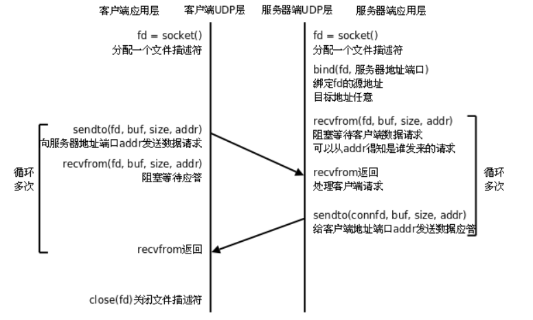
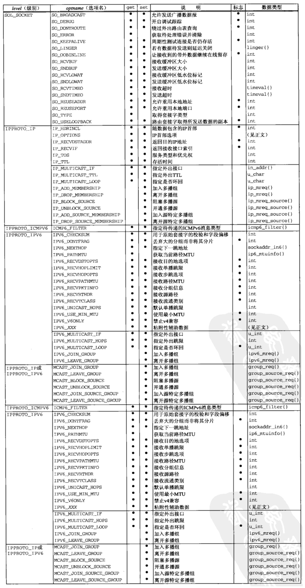

<!--
 * @Description: 
 * @version: 1.80.1
 * @Author: ZGG
 * @Date: 2023-08-14 18:23:07
 * @LastEditors: ZGG
 * @LastEditTime: 2023-08-15 14:05:18
-->
## UDP用户数据报协议
### 一、UDP套接字流程步骤
UDP（User Datagram Protocol，用户数据报协议）是一种面向无连接的传输层协议。相对于TCP，UDP更简单，没有可靠性保证和流量控制机制，但是因此也更加高效。

相较于TCP而言，UDP通信的形式更像是发短信。不需要在数据传输之前建立、维护连接。只专心获取数据就好。省去了三次握手的过程，通信速度可以大大提高，但与之伴随的通信的稳定性和正确率便得不到保证。因此，我们称UDP为"无连接的不可靠报文传递"。

那么与我们熟知的TCP相比，UDP有哪些优点和不足呢?由于无需创建连接，**所以UDP开销较小，数据传输速度快，实时性较强**。多用于对实时性要求较高的通信场合，如视频会议、电话会议等。但随之也伴随着数据传输不可靠，传输数据的正确率、传输顺序和流量都得不到控制和保证。所以，通常情况下，使用UDP协议进行数据传输，为保证数据的正确性，我们需要在应用层添加辅助校验协议来弥补UDP的不足，以达到数据可靠传输的目的。

与TCP类似的，UDP也有可能出现缓冲区被填满后，再接收数据时丢包的现象。由于它没有TCP滑动窗口的机制，通常采用如吓下两种方法解决:
> * 服务器应用层设计流量控制，控制发送数据速度。
> * 借助setsockopt函数改变接收缓冲区大小。

下面是UDP基本的通信流程：

1. 创建UDP套接字：使用`socket`函数创建一个UDP套接字，指定地址族（如IPv4或IPv6）和套接字类型（如`SOCK_DGRAM`）。

2. 绑定地址：使用`bind`函数将套接字绑定到本地地址和端口。如果不需要绑定特定地址，可以跳过此步骤。

3. 接收数据：使用`recvfrom`函数从已经绑定的套接字接收数据，可以指定缓冲区、数据长度、标志等参数。该函数会阻塞直到有数据到达。

4. 发送数据：使用`sendto`函数向指定的目标地址发送数据，需要指定目标地址、数据长度、标志等参数。

5. 关闭套接字：使用`close`或`closesocket`函数关闭UDP套接字。

以上是UDP基本的通信流程。需要注意的是，UDP是无连接的协议，每次发送和接收都是独立的操作，不会像TCP那样建立和维护连接。因此，在使用UDP进行通信时，需要在应用层自行处理数据的可靠性和顺序控制。

#### UDP通信流程



### 套接字选项获取和设置 
> 每个套接字在不同的协议层次(级别)上有不同的行为属性(选项)
> 有两个函数用于 设置/获取 套接字的选项

在网络编程中，获取和设置套接字选项是通过以下函数来实现的：

1. getsockopt()：用于获取套接字的选项值。函数原型如下：
   ```
   int getsockopt(int sockfd, int level, int optname, void *optval, socklen_t *optlen);
   ```
   - `sockfd`：套接字描述符。
   - `level`：选项所属的协议层或套接字类型，常用的值有`SOL_SOCKET`（通用套接字选项）、`IPPROTO_TCP`（TCP选项）和`IPPROTO_IP`（IP选项）等。
   - `optname`：选项名称，用于指定要获取的具体选项的值，如`SO_RCVBUF`（接收缓冲区大小）、`SO_REUSEADDR`（地址重用）等。
   - `optval`：用于接收选项值的缓冲区。
   - `optlen`：指向整数变量的指针，表示`optval`缓冲区的大小。

2. setsockopt()：用于设置套接字的选项值。函数原型如下：
   ```
   int setsockopt(int sockfd, int level, int optname, const void *optval, socklen_t optlen);
   ```
   - `sockfd`：套接字描述符。
   - `level`：选项所属的协议层或套接字类型，常用的值有`SOL_SOCKET`（通用套接字选项）、`IPPROTO_TCP`（TCP选项）和`IPPROTO_IP`（IP选项）等。
   - `optname`：选项名称，用于指定要设置的具体选项的值，如`SO_RCVBUF`（接收缓冲区大小）、`SO_REUSEADDR`（地址重用）等。
   - `optval`：指向要设置的选项值的指针。
   - `optlen`：选项值的长度。

这些函数可以用于获取和设置套接字的各种选项，比如设置套接字的超时时间、开启或关闭地址重用、设置接收缓冲区大小等。具体可用的选项值和其对应的常量名称会根据不同的操作系统和网络库而有所差异，可以参考相应的文档进行使用。




### UDP广播通信

###### 1.UDP广播通信概念
> UDP广播是一种在局域网内发送UDP数据包到所有主机的通信方式。通过UDP广播，可以将数据包发送给同一局域网下的所有设备，而不需要明确指定目标主机。
###### 注意：只有用户数据报套接字(使用UDP协议)才能广播

要使用UDP广播，需要注意以下几个步骤：

1. 创建UDP套接字：使用`socket()`函数创建一个UDP套接字。套接字类型为`SOCK_DGRAM`，协议为IPv4时使用`AF_INET`。

2. 设置套接字选项：使用`setsockopt()`函数设置套接字的广播选项。将`SO_BROADCAST`选项设置为1，以允许发送广播数据包。

3. 绑定本地地址：使用`bind()`函数将套接字绑定到本地地址。指定一个可用的IP地址和端口号，例如使用`INADDR_ANY`表示任意可用的IP地址，端口号使用`0`表示由系统自动分配。

4. 准备广播数据：准备要发送的数据，并将其放入一个缓冲区。

5. 发送广播：使用`sendto()`函数发送UDP数据包。指定广播地址（通常为特定的IP地址，如`255.255.255.255`）作为目标地址，以及相应的端口号。

6. 关闭套接字：完成广播后，使用`close()`函数关闭套接字。

需要注意的是，在进行UDP广播时，需要确保目标网络支持广播功能，且防火墙或路由器未阻止广播数据包的传输。此外，接收方也需要开启相应的UDP广播接收功能，以便接收广播数据。

###### 2.广播地址

> 广播地址是在网络中用于向所有主机发送消息的特殊地址。当一台主机发送消息到广播地址时，网络中的所有主机都可以接收到该消息。

> 在IPv4网络中，广播地址是指特定网络的最后一个地址，该地址所有位都设置为1。例如，对于一个以192.168.1.0为网络地址，子网掩码为255.255.255.0的局域网，广播地址将是192.168.1.255。

> 在IPv6网络中，广播地址是通过使用多播地址实现的。IPv6的广播地址被称为组播地址。组播地址用于向特定的IPv6多播组发送消息，然后由该组中的所有主机接收。IPv6广播地址的范围是ff00::/8。

需要注意的是，广播地址的使用受到网络配置和安全策略的限制。在大多数情况下，广播地址的使用应受到限制，以避免滥用或网络拥塞的风险。


**下面是一个基本的UDP广播发送端的C语言代码示例：**

```c
#include <stdio.h>
#include <stdlib.h>
#include <string.h>
#include <unistd.h>
#include <sys/socket.h>
#include <netinet/in.h>
#include <arpa/inet.h>

#define BROADCAST_IP "255.255.255.255"  // 广播地址
#define BROADCAST_PORT 12345             // 广播端口号

int main() {
    int sock;
    struct sockaddr_in broadcastAddr;
    char *broadcastIP = BROADCAST_IP;
    unsigned short broadcastPort = BROADCAST_PORT;
    char *sendMsg = "Hello, broadcast!";
    int sendMsgLen = strlen(sendMsg);

    // 创建UDP套接字
    if ((sock = socket(AF_INET, SOCK_DGRAM, 0)) < 0) {
        perror("socket creation failed");
        exit(EXIT_FAILURE);
    }

    // 设置广播属性
    int broadcastEnable = 1;
    if (setsockopt(sock, SOL_SOCKET, SO_BROADCAST, &broadcastEnable, sizeof(broadcastEnable)) < 0) {
        perror("setsockopt failed");
        exit(EXIT_FAILURE);
    }

    // 设置广播地址和端口号
    memset(&broadcastAddr, 0, sizeof(broadcastAddr));
    broadcastAddr.sin_family = AF_INET;
    broadcastAddr.sin_addr.s_addr = inet_addr(broadcastIP);
    broadcastAddr.sin_port = htons(broadcastPort);

    // 发送广播消息
    if (sendto(sock, sendMsg, sendMsgLen, 0, (struct sockaddr *)&broadcastAddr, sizeof(broadcastAddr)) != sendMsgLen) {
        perror("sendto failed");
        exit(EXIT_FAILURE);
    }

    printf("Broadcast message sent!\n");

    close(sock);

    return 0;
}
```

在示例代码中，广播地址和端口号分别使用宏定义，你可以根据实际需求进行修改。同时，需要确保网络环境和操作系统的限制，以便成功发送广播数据。

请注意，示例代码中没有进行错误处理的详细逻辑，实际使用时建议根据需要进行适当的错误处理。


**下面是一个基本的UDP广播接收端的C语言代码示例：**

```c
#include <stdio.h>
#include <stdlib.h>
#include <unistd.h>
#include <sys/socket.h>
#include <netinet/in.h>
#include <arpa/inet.h>

#define BROADCAST_PORT 12345  // 广播端口号

int main() {
    int sock;
    struct sockaddr_in broadcastAddr;
    unsigned short broadcastPort = BROADCAST_PORT;
    char recvMsg[1024];
    int numBytes;

    // 创建UDP套接字
    if ((sock = socket(AF_INET, SOCK_DGRAM, 0)) < 0) {
        perror("socket creation failed");
        exit(EXIT_FAILURE);
    }

    // 设置套接字为广播模式
    int broadcastEnable = 1;
    if (setsockopt(sock, SOL_SOCKET, SO_BROADCAST, &broadcastEnable, sizeof(broadcastEnable)) < 0) {
        perror("setsockopt failed");
        exit(EXIT_FAILURE);
    }

    // 绑定端口号
    memset(&broadcastAddr, 0, sizeof(broadcastAddr));
    broadcastAddr.sin_family = AF_INET;
    broadcastAddr.sin_addr.s_addr = htonl(INADDR_ANY);
    broadcastAddr.sin_port = htons(broadcastPort);

    if (bind(sock, (struct sockaddr *)&broadcastAddr, sizeof(broadcastAddr)) < 0) {
        perror("bind failed");
        exit(EXIT_FAILURE);
    }

    while (1) {
        // 接收广播消息
        numBytes = recvfrom(sock, recvMsg, sizeof(recvMsg), 0, NULL, NULL);
        if (numBytes < 0) {
            perror("recvfrom failed");
            exit(EXIT_FAILURE);
        }

        // 在接收到的消息后添加字符串结束符
        recvMsg[numBytes] = '\0';

        // 处理接收到的广播消息
        printf("Received broadcast message: %s\n", recvMsg);
    }

    close(sock);

    return 0;
}
```

在示例代码中，接收端使用`recvfrom()`函数从广播套接字接收数据，并打印接收到的广播消息。

你可以根据实际需求修改代码中的广播端口号，并根据需要增加适当的错误处理。同时，确保接收端和发送端的广播地址和端口号匹配。

请注意，在实际使用时，应该考虑多线程或非阻塞的方式接收广播消息，以免阻塞主线程。此外，还应该注意网络环境和操作系统的限制，以确保能够成功接收广播数据。

### UDP组播

**UDP（User Datagram Protocol）是一种无连接的传输协议**，它提供了一种不可靠的数据传输方式。UDP组播是基于UDP协议的一种多播传输方式。

**组播（Multicast）是一种点对多点的通信方式**，它可以同时将数据传输给多个接收者。在组播中，发送者只需将数据一次性发送到组播地址，而不需要为每个接收者建立独立的连接。路由器会根据接收者的加入和离开动态地维护一个接收者列表，并转发数据给这些接收者。

UDP组播利用UDP协议的特点，可以实现高效的多播传输。它适用于一对多的实时通信场景，如视频直播、音频广播等。通过使用组播，可以减少网络带宽的消耗，降低服务器的负载，并且可以快速将数据传输给多个接收者。

在UDP组播中，发送方通过指定一个组播地址，将数据发送给该组播地址即可。接收方需要加入指定的组播组，并监听该组播地址，以接收发送方发送的数据。

需要注意的是，UDP组播是一种不可靠的传输方式，数据传输过程中可能会存在丢包或乱序的情况。因此，在应用UDP组播时需要考虑数据可靠性和顺序性的需求，可以通过一些机制如重传、定序等来增加可靠性。

总结起来，UDP组播是基于UDP协议的一种多播传输方式，适用于一对多的实时通信场景，提供了高效的多播传输能力。

###### IP地址分类

IP地址分类是根据IP地址的前缀（即网络部分）的长度来进行的，最常见的IP地址分类有以下几类：

* A类地址：以0开头的IP地址，范围从1.0.0.0到126.0.0.0。A类地址的前8位用于标识网络部分，后24位用于标识主机部分。A类地址可以分配给大型网络，通常是作为给政府机构使用,可容纳大量的主机。

* B类地址：以10开头的IP地址，范围从128.0.0.0到191.255.0.0。B类地址的前16位用于标识网络部分，后16位用于标识主机部分。B类地址适用于中型网络，通常是作为大型公司使用，可容纳较多的主机。

* C类地址：以110开头的IP地址，范围从192.0.0.0到223.255.255.0。C类地址的前24位用于标识网络部分，后8位用于标识主机部分。C类地址适用于小型网络，可容纳较少的主机。

* D类地址：以1110开头的IP地址，范围从224.0.0.0到239.255.255.255。D类地址是用于组播（多播），不用于主机或网络标识。

* E类地址：以1111开头的IP地址，范围从240.0.0.0到255.255.255.255。E类地址被保留，用于特殊用途，例如研究和实验。

需要注意的是，IP地址分类在现代网络中已经不再被广泛使用，而是逐渐被无类别域间路由（CIDR）取代。CIDR采用了更加灵活的地址分配方式，使得网络划分更加精确和高效。

**特殊地址**

在网络中，有一些特殊的地址用于特定的目的或具有特殊的含义。以下是一些常见的特殊地址：

- 1.保留地址（Reserved Addresses）：这些地址是为特定目的而保留的，不能用作主机的IP地址。例如，在IPv4中，0.0.0.0被用作默认路由（Default Gateway）或表示任意主机（Wildcard Address）。在IPv6中，::表示未指定的地址。

- 2.回环地址（Loopback Address）：在IPv4中，回环地址为127.0.0.1。回环地址用于将数据发送给本地主机，用于测试与本机的通信。所有发送给回环地址的数据都返回给发送者。在IPv6中，回环地址为::1。

- 3.广播地址（Broadcast Address）：广播地址用于将数据发送到网络中的所有主机。在IPv4中，广播地址是特定网络中的最后一个地址，所有位都设置为1。例如，对于网络地址192.168.0.0/24，广播地址为192.168.0.255。在IPv6中，广播已被弃用，而使用多播（Multicast）来实现群发。

- 4.特定目的地址（Special-Purpose Addresses）：这些地址用于特定的网络功能或协议。例如，在IPv4中，169.254.0.0/16用于自动配置IP（APIPA）；224.0.0.0/4用于组播；192.0.0.0/24用于IPv6转换。

- 5.MAC特殊地址：在以太网中，MAC地址空间中有一些特殊的地址。例如，广播MAC地址（FF:FF:FF:FF:FF:FF）将数据发送到网络中的所有设备。多播MAC地址用于将数据发送到特定的组播组。

特殊地址具有特定的用途和含义，并在网络中具有特殊的行为。了解这些特殊地址对于网络配置和协议实现非常重要，能够正确地管理和使用这些地址。

#### 组播的结构体(关键)
```c
#define IP_ADD_MEMBERSHIP
struct ip_mreq
{                                
    struct in_addr imr_multiaddr; // 多播组地址(D类地址)
    // 表示你要加入哪个组。如:224.10.10.1
    struct in_addr imr_interface; // 接口(网卡)ip地址
    // 需要加入到多组的IP地址
};
```

#### 组播的基本流程步骤

###### 1.UDP的接收端

```c
#include<stdio.h>
#include <sys/types.h>          /* See NOTES */
#include <sys/socket.h>
#include <netinet/in.h>
#include <arpa/inet.h>
#include <string.h>

#define OWNADDR "192.168.112.109" //接收端的IP地址   自己ubuntu的IP地址

#define GROUPADDR   "224.0.0.10" //组播地址
#define GROUPPORT   10000

int main()
{
    //1、创建UDP数据报套接字
    int socketfd = socket(AF_INET,SOCK_DGRAM,0);
    if(socketfd == -1)
    {
        perror("socket error");
        return -1;
    }
    //2、定义组播结构体
    struct ip_mreq vmreq;

    //3、设置组播ip（初始化 组播结构体）
    inet_pton(AF_INET,GROUPADDR,&vmreq.imr_multiaddr); // 组播地址
    inet_pton(AF_INET,OWNADDR,&vmreq.imr_interface); // 需要添加到组的ip
    
    //4）加入组播属性（也就是设置这个套接字 可以接收组播信息）
    setsockopt(socketfd,IPPROTO_IP,IP_ADD_MEMBERSHIP,&vmreq,sizeof(vmreq));

    //5）绑定地址
    struct sockaddr_in saddr;
    saddr.sin_family = AF_INET;
    saddr.sin_port = htons(GROUPPORT);
    saddr.sin_addr.s_addr = htonl(INADDR_ANY); //htonl(INADDR_ANY)  代表 主机所有的地址

    bind(socketfd,(struct sockaddr *)&saddr,sizeof(saddr));

    //6）接收数据
    struct sockaddr_in otherAddr;
    int len = sizeof(struct sockaddr_in);
    
    while(1)
    {
        char buf[1024]={0};
        
        recvfrom(socketfd,buf,sizeof(buf),0, (struct sockaddr *)&otherAddr,&len);

        printf("来自 %s:%u  recv:%s\n",inet_ntoa(otherAddr.sin_addr),ntohs(otherAddr.sin_port),buf);
    }
    
    //关闭 
    close(socketfd);
    
    return 0;
}
```

###### 2.UDP的发送端

```c
#include<stdio.h>
#include <sys/types.h>          /* See NOTES */
#include <sys/socket.h>
#include <netinet/in.h>
#include <arpa/inet.h>
#include <string.h>


#define GROUPADDR   "224.0.0.10" //组播地址
#define GROUPPORT   10000

int main()
{
    printf("组播发送端.....\n");
    
    //1、创建UDP数据报套接字
    int socketfd = socket(AF_INET,SOCK_DGRAM,0);
    if(socketfd == -1)
    {
        perror("socket error");
        return -1;
    }
    //2、发送数据，往组播地址(224.0.0.10 )里面发送数据
    struct sockaddr_in sendAddr;//IPV4地址结构体变量
    sendAddr.sin_family = AF_INET;
    sendAddr.sin_port = htons(GROUPPORT);
    sendAddr.sin_addr.s_addr = inet_addr(GROUPADDR);//一定是组播地址
    
    while(1)
    {
        char buf[1024]={0};
        printf("data:");
        scanf("%s",buf); 
        sendto(socketfd,buf,strlen(buf),0,( struct sockaddr *)&sendAddr,sizeof(sendAddr));
    }
    
    
    //3、关闭 
    close(socketfd);
    
    return 0;
}
```

